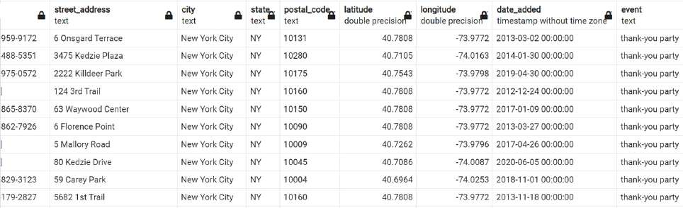
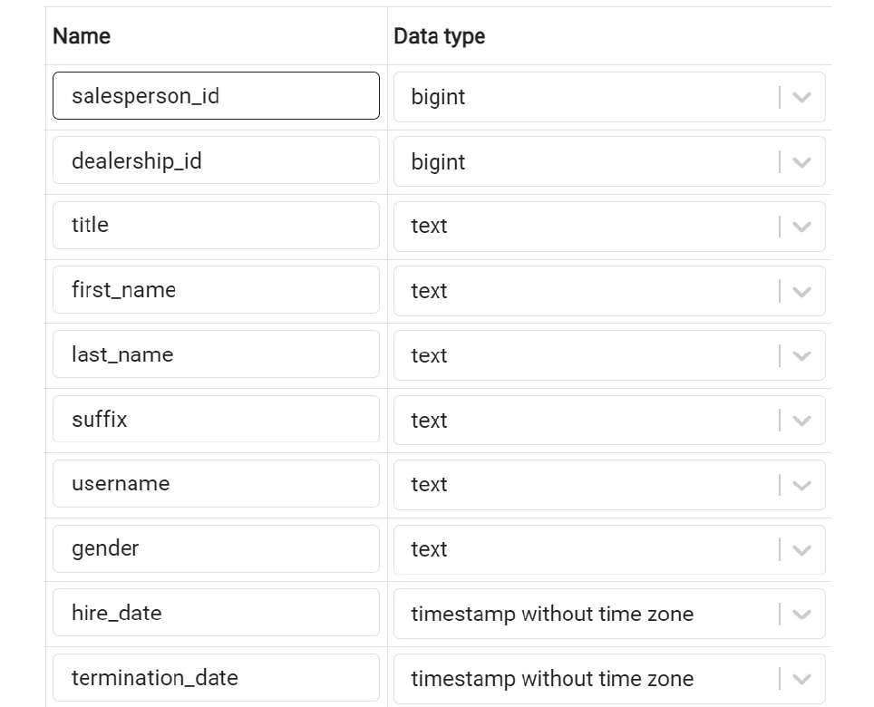
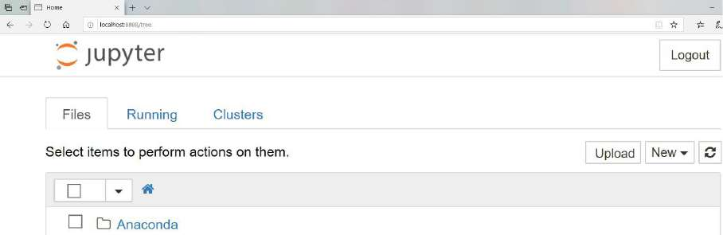

## Querying the salespeople Table Using Basic Keywords in a SELECT Query

You will create various queries using basic keywords in a **SELECT** query. For instance, after a few days at your new job, you finally get access to the company database. Your boss has asked you to help a sales manager who does not know SQL particularly well. The sales manager
would like a couple of different lists of salespeople.


First, you need to generate a list of the first 10 salespersons hired by dealership 17, that is, the salespersons with oldest **hire_date**, ordered by hiring date, with the oldest first. 

Second, you need to get all salespeople that were hired in 2021 and 2022 but have not been terminated, that is, the **hire_date** must be later than 2021-01-01, and **terminiation_date** is **NULL**, ordered by hire date, with the latest first. 

Finally, the manager wants to find a salesperson that was hired in 2021 but
only remembers that their first name starts with "Nic." He has asked you to help find this person. You will use your SQL skill to help the manager to achieve these goals.


3. Execute the following query to get the usernames of salespeople from dealership_id 17, sorted by their hire_date values, and then set LIMIT to 10:   Usernames of 10 earliest salespeople in dealership 17 sorted by hire date
```
SELECT *
FROM salespeople
WHERE dealership_id = 17
ORDER BY hire_date
LIMIT 10;
```

### Output after running the query


4. Now, to find all the salespeople that were hired in 2021 and 2022 but have not been terminated, that is, the hire_date must be later than 2021-01-01, and termination_date is null, ordered by hire date, with the latest first:
```
SELECT *
FROM salespeople
WHERE hire_date >= '2021-01-01'
AND termination_date IS NULL
ORDER BY hire_date DESC;
```
54 rows are returned from this SQL. The following are the first few rows of the output:


5. Now, find a salesperson that was hired in 2021 and whose first name starts with Nic.

```
SELECT *
FROM salespeople
WHERE first_name LIKE 'Nic%'
AND hire_date >= '2021-01-01'
AND hire_date <= '2021-12-31';
```


Column constraints are keywords that help you specify the properties you want to attribute to a particular column. In other words, you can ensure that all the rows in that column adhere to your   specified constraint. Some major column constraints are as follows:

- **NOT NULL**: This constraint guarantees that no value in a column can be NULL.
- **UNIQUE**: This constraint guarantees that every single row for a column has a unique value and that no value is repeated.
- **PRIMARY KEY**: This is a special constraint that is unique for each row and helps you to find a specific row more quickly. If the primary key of this table contains only one column, you can add this **PRIMARY KEY** constraint to the column definition of the primary key column. If the
primary key of this table consists of multiple columns, you need to use a table constraint to define the key in the **CREATE** statement.

## Creating a Table in SQL
In this exercise, you will create a table using the CREATE TABLE statement. The marketing team at ZoomZoom would like to create a table called countries to analyze the data of different countries. It should have four columns: an integer key column, a unique name column, a founding year column, and a capital column.

2. Execute the following query to drop the countries table since it already exists in the database:
```
DROP TABLE IF EXISTS countries;
```

3. Run the following query to create the countries table:
```
CREATE TABLE countries (
  key INT PRIMARY KEY,
	name text UNIQUE,
	founding_year INT,
	capital text
);
```

### Creating Tables with SELECT query
You already know how to create a table. However, say you wanted to create a table using data from an existing table. This can be done by using a modification of the **CREATE TABLE** statement:
```
CREATE TABLE {table_name} AS (
{select_query}
);
```
Here, **{select_query}** is any **SELECT** query that can be run in your database. For instance, say you wanted to create a table based on the **products** table that only had products from the year 2014. Suppose the title of the table is **products_2014**; you could write the following query:

```
CREATE TABLE products_2014 AS (
SELECT *
FROM products
WHERE year=2014
)
```

This can be done with any query, and the table will inherit all the properties of the output query.
PostgreSQL also provides another way to create a table from a query, which utilizes a **SELECT … INTO …**syntax. An example of this syntax is shown below:
```
SELECT *
INTO products_2014
FROM products
WHERE year=2014;
```

One issue with creating a table with a query is that the data types of the query are not explicitly specified and can be confusing. Luckily, PostgreSQL stores the table definitions in a set of system tables, and you can read the table definition from the system tables. For example, to check the column definitions of the products_2014 table, you can run the following SQL:
```
SELECT COLUMN_NAME, DATA_TYPE
FROM INFORMATION_SCHEMA.COLUMNS
WHERE TABLE_NAME = 'products_2014';
```
From the result, you can identify all the columns and their data types in the products_2014 table:


## Updating Tables
Over time, you may also need to modify a table by adding columns, adding new data, or updating existing rows. 

### Adding and Removing Columns
To add new columns to an existing table, you use the **ALTER TABLE … ADD COLUMN** statement, as shown in the following query:
```
ALTER TABLE {table_name}
ADD COLUMN {column_name} {data_type};
```

For example, if you wanted to add a new column to the **products_2014** table that you will use to store the products' weights in kilograms called **weight**, you could do this by using the following
query:
```
ALTER TABLE products_2014
ADD COLUMN weight INT;
```
This query will make a new column called **weight** in the **products_2014** table and will give it the integer data type so that only integers can be stored in it.


If you want to remove a column from a table, you can use the **ALTER TABLE … DROP COLUMN** statement:
```
ALTER TABLE {table_name}
DROP COLUMN {column_name};
```
Here, **{table_name}** is the name of the table you want to change, and **{column_name}** is the name of the column you want to drop.

Imagine that you decide to delete the **weight** column you just
created. You could get rid of it using the following query:
```
ALTER TABLE products_2014
DROP COLUMN weight;
```
As you can see from the screenshot below, the column is dropped:


## Adding New Data
You can add new data to a table using several methods in SQL. One of those methods is to simply insert values straight into a table using the **INSERT INTO… VALUES** statement. It has the following structure:
```
INSERT INTO {table_name} (
{column_1], {column_2}, …{column_last}
)
VALUES (
{column_value_1}, {column_value_2}, … {column_value_last}
);
```
Here, **{table_name}** is the name of the table you want to insert your data into, **{column_1}, {column_2}, … {column_last}** is a list of the columns whose values you want to insert, and **{column_value_1}, {column_value_2}, … {column_value_last}** is the list of values you want to insert into the table. If a column in the table is not put into the **INSERT** statement, the column is assumed to have a **NULL** value.

For example, say you want to insert a new entry for a scooter into the **products_2014** table. This can be done with the following query:
```
INSERT INTO products_2014 (
  product_id, model, year, product_type, base_msrp, production_start_date, production_end_date
)
VALUES (
  13, 'Nimbus 5000', 2014, 'scooter', 500.00, '2014-03-03', '2020-03-03'
);
```
This query adds a new row to the **products_2014** table accordingly. You can run a **SELECT** query to see all the rows in the table:
```
SELECT *
FROM products_2014;
```


Another way to insert data into a table is to use the **INSERT** statement with a **SELECT query** using the following syntax:
```
INSERT INTO {table_name} ({column_1], {column_2}, …{column_last})
{select_query};
```
Here, **{table_name}** is the name of the table into which you want to insert the data, **{column_1}, {column_2}, … {column_last}** is a list of the columns whose values you want to insert, and **{select query}** is a query with the same structure as the values you want to insert into the table.

Take the example of the **products_2014** table. You have created it with a **SELECT** query with one row. Earlier in this section, you have inserted one row into it. So, now it contains two rows. If you also want to insert the products from 2016, you could use the following query, which inserts one more row into the table:

```
INSERT INTO products_2014(
product_id, model, year, product_type, base_msrp,
production_start_date, production_end_date
)
SELECT*
FROM products
WHERE year=2016;
```
This query produces the following result:


Now it contains three rows from three different ways of inserting data: one row from **CREATE** as the result of a **SELECT** query, one row from an **INSERT** with data, and one row from **INSERT** using the result of a **SELECT** query.

## Updating existing rows
Sometimes, you may need to update the values of the data present in a table. To do this, you can use the **UPDATE** statement:
```
UPDATE {table_name} SET
{column_1} = {column_value_1},
{column_2} = {column_value_2},
…
{column_last} = {column_value_last}
WHERE {conditional};
```
Here, **{table_name}** is the name of the table with data that will be changed, **{column_1}, {column_2},… {column_last}** is the list of columns whose values you want to change, **{column_value_1}, {column_value_2}, … {column_value_last}** is the list of new values you want to update into those columns, and **{WHERE}** is a conditional statement like the one you would find in a **SELECT** query.

To illustrate its use of the **UPDATE** statement, imagine that, for the rest of the year, the company has decided to sell all scooter models before 2018 for $299.99. You could change the data in the **products_2014** table using the following query:
```
UPDATE Products_2014 SET
base_msrp = 299.99
WHERE product_type = 'scooter'
AND year<2018;
```
This query produces the following output. You can see that the **base_msrp** column of all three records has been updated to **299.99** because they are all scooters manufactured before 2018.


## Updating the Table to Increase the Price of a Vehicle
You will update the data in a table using the **UPDATE** statement. Due to an increase in the cost of the rare metals needed to manufacture an electric vehicle, the 2022 Model Chi will need to undergo a price hike of 10%. The current price is $95,000.

In a real-world scenario, you will update the **products** table to increase the price of this product. However, because you will use the same **sqlda** database throughout, it would be better to keep the values in the original tables unchanged so that your SQL results remain consistent. For this reason, you will create new tables for all the **INSERT, ALTER, UPDATE, DELETE,** and **DROP** statement examples.

Perform the following steps to complete the exercise:
1. Open **pgAdmin**, connect to the **sqlda** database, and open SQL query editor.
2. Run the following query to create a **product_2022** table from the **products** table:
```
CREATE TABLE products_2022 AS (
  SELECT *
	FROM products
	WHERE year=2022
);
```
3. Run the following query to update the price of Model Chi by 10% in the **products_2022** table:
```
UPDATE products_2022 SET
  base_msrp = base_msrp*1.10
  WHERE model='Model Chi'
  AND year=2022;
```
 4. Write the **SELECT** query to check whether the price of Model Chi in 2022 has been updated: 
```
SELECT *
FROM products_2022
WHERE model='Model Chi'
AND year=2022;
```
The following is the output of the preceding code:


As you see from the output, the price of Model Chi is now $104,500; it was previously $95,000.

## Deleting Data and Tables
You often discover that data in a table is out of date and, therefore, can no longer be used. At such times, you might need to delete data from a table.
### Deleting Values from a Row
Often, you might be interested in deleting a value from a row. The easiest way to accomplish this is to use the **UPDATE** structure that has already been discussed, and by setting the column value to **NULL**:
```
UPDATE {table_name} SET{column_1} = NULL,
{column_2} = NULL,
…
{column_last} = NULL
WHERE {conditional};
```
Here, **{table_name}** is the name of the table with the data that needs to be changed, **{column_1}, {column_2},… {column_last}** is the list of columns whose values you want to delete, and **{WHERE}** is a conditional statement like the one you would find in a **SELECT** query.

For instance, you have the wrong email address on file for the customer with the **customer ID** equal to **3**. To fix that, you can use the following query:
```
UPDATE customers SET
email = NULL
WHERE customer_id=3;
```
However, there might be cases where you might need to delete rows from a table. For example, in the database, you have a row labeled **test customer**, which is no longer needed and needs to be deleted. 

### Deleting Rows from a Table
Deleting a row from a table can be done using the **DELETE** statement, which looks like this:
```
DELETE FROM {table_name}
WHERE {condition};
```
For instance, you must delete the products whose **product_type** is **scooter** from the **products_2014** table. To do that, you can use the following query:
```
DELETE FROM products_2014
WHERE product_type='scooter';
```
You have inserted three products into this table, all scooters. After running the **DELETE** statement, PostgreSQL shows that there was no product in this table anymore as all records are deleted.


If you want to delete all the data in the **products_2014** table without deleting the table, you could write the following query, which is **DELETE** without any conditions:
```
DELETE FROM products_2014;
```
Alternatively, if you want to delete all the data in a query without deleting the table, you could use the **TRUNCATE** keyword like so:
```
TRUNCATE TABLE products_2014;
```

### Deleting Tables
To delete all the data in a table and the table itself, you can just use the **DROP TABLE** statement with the following syntax:
```
DROP TABLE {table_name};
```
Here, **{table_name}** is the name of the table you want to delete. If you wanted to delete all the data in the **products_2014** table along with the table itself, you would write the following:
```
DROP TABLE products_2014;
```
If you want to read from this table, you will receive an error message from PostgreSQL telling you that the table does not exist:
```
DROP TABLE products_2014;

SELECT * FROM products_2014;
```


Once the table is dropped, all aspects of this table are gone, and you cannot perform any operations on it. For example, if you try to run the **DROP TABLE products_2014** statement again, you will run into an error. A PostgreSQL enhancement of the **DROP** statement is **DROP TABLE IF EXISTS**. This statement will check the existence of the table. If the table is not in the database, PostgreSQL will skip this statement with a notification, but without reporting an error, as shown below:
```
DROP TABLE IF EXISTS products_2014;
```

**DROP TABLE IF EXISTS** is helpful if you want to automate SQL script execution. One common usage scenario is to use it before the **CREATE TABLE** statement. If the table already exists, your **CREATE TABLE** statement will fail and raise an error. But if your **DROP TABLE IF EXISTS**
statement is before your **CREATE TABLE** statement, pre-existing tables would have been dropped before you tried to recreate them. This is useful in automated computing operations where you constantly create temporary tables that you do not need after the current computing job is completed.

The catch is that you must make sure that the table is truly temporary and is not used by anyone else. Otherwise, you may accidentally drop tables that are used by some other users without knowing. For this reason, the **DROP TABLE IF EXISTS** statement is usually only used in environments
designated for automated data processing.

### Deleting an Unnecessary Reference Table
you will learn how to delete a table using SQL. For instance, the marketing team has finished analyzing the potential number of customers they have in every state, and they no longer need the **state_populations** table. To save space in the database, delete the table. If you have not
created this table, please go back to the Simple CREATE Statement and create it now.
1. Open pgAdmin, connect to the **sqlda database**, and open **SQL query editor**.
2. Run the following query to drop the **state_populations** table:
```
DROP TABLE state_populations;
```
3. Check that the **state_populations** table has been deleted from the database.
4. Since the table has just been dropped, a **SELECT** query on this table throws an error, as expected:
```
SELECT * FROM state_populations;
```
You will find the error in the following figure: 


5. Also, drop the **products_2022** table that was created above to keep the database clean:
```
DROP TABLE products_2022;
```

### Creating and Modifying Tables for Marketing Operations
You did a great job of pulling data for the marketing team. However, the marketing manager, who you helped, realized that they had made a mistake. It turns out that instead of just the query, the manager needs to create a new table in the company's analytics database. Furthermore, they need to make some changes to the data that is present in the **customers table**. It is your job to help the marketing manager with the table:

1. Open pgAdmin, connect to the **sqlda** database and open SQL query editor. Create a new table called **customers_nyc** that pulls all the rows from the **customers** table where the customer lives in New York City in the state of New York.

```
CREATE TABLE customers_nyc AS (
SELECT *
FROM customers
WHERE city='New York City'
AND state='NY'
);
```
Run the following code to see the output:
```
SELECT * FROM customers_nyc;
```
This is the output of the code:


2. Delete all customers in postal code 10014 from the new table. Due to local laws, they will not be eligible for marketing.
Run the following query statement to delete users with the postal code 10014:
```
DELETE FROM customers_nyc
WHERE postal_code='10014';
```

3. Add a new text column called **event**.
Execute the following query to add the new **event** column:
```
ALTER TABLE customers_nyc
ADD COLUMN event text;
```

4. Set the value of the event column to **thank-you party**.
Update the **customers_nyc** table and set the **event** column to **thank-you party** using the following query:
```
UPDATE customers_nyc SET
event = 'thank-you party';
```
Run the following code to see the output:
```
SELECT *
FROM customers_nyc;
```
The following is the output of the code:


You tell the manager that you have completed these steps. He tells the marketing operations team, who then uses the data to launch a marketing campaign. The marketing manager then asks you to delete the **customers_nyc** table.

Delete the **customers_nyc** table as asked by the manager using **DROP TABLE**:
```
DROP TABLE customers_nyc;
```


# SQL for Data Preparation
In the real world, as a data analyst, you usually do not handle the entire CRUD flow. To be more specific, you usually do not create datasets from scratch. You will receive data from outside sources. This data is usually in a form that would not fit your needs perfectly and you would need to perform some transform operations to make the data usable. One such operation is the creation of clean datasets from existing raw datasets. The raw data may be missing some information, contain information that is not in the format that fits your needs, or contains information that may not be accurate.

According to Forbes, it is estimated that almost 80% of the time spent by analytics professionals involves preparing data. Building models with unclean data harms analysis by leading to poor conclusions. SQL can help in this tedious but important task by providing efficient ways to build clean datasets.

## Assembling Data
### Connecting Tables using JSON
Most of the time, the data you are interested in is spread across multiple tables. A simple **SELECT** statement over one table will not be enough to get you what you need. Fortunately, SQL has methods for bringing related tables together using the **JOIN** keyword.

To illustrate, look at two tables in the **ZoomZoom** database—**dealerships** and **salespeople**.


And the **salespeople** table looks like this:


In the **salespeople** table, you can observe that there is a column called **dealership_id**. This **dealership_id** column is a direct reference to the **dealership_id** column in the **dealerships** table.

When table A has a column that references the primary key of table B, the column is said to be a foreign key to table A. In this case, the **dealership_id** column in salespeople is a foreign key to the dealerships table.

**Note**
*Foreign keys can also be added as a column constraint to a table to improve the integrity of the data by making sure that the foreign key never contains a value that cannot be found in the referenced table. This data property is known as **referential integrity**. The method of adding foreign key constraints can also help to improve performance in some databases. Foreign key constraints are not used in most analytical databases and are beyond the scope of this text. You can learn more about
foreign key constraints in the official PostgreSQL documentation.*

As these two tables are related, you can perform some interesting analyses with them. 

For instance, you may be interested in determining which salespeople work at a dealership in California. One way of retrieving this information is to first query which dealerships are in California. You can do this using the following query:
```
SELECT *
FROM dealerships
WHERE state='CA';
```
This query should give you the following results:


Now that you know that the only two dealerships in California have the IDs of **2** and **5**, respectively, you can then query the **salespeople** table, as follows:
```
SELECT *
FROM salespeople
WHERE dealership_id in (2, 5)
ORDER BY 1;
```
The following are the first rows of the output of the code:


While this method gives you the results you want, it is tedious to perform two queries to get these results. What would make this process easier would be to somehow add the information from the **dealerships** table to the **salespeople** table and then filter for users in California. SQL provides such a tool with the **JOIN** clause. The **JOIN** clause is a SQL clause that allows a user to join one or more tables together based on distinct conditions.

### Types of Joins


## Inner Joins
An inner join connects rows in different tables, based on a condition known as the **join predicate**. In many cases, the join predicate is a logical condition of equality. Each row in the first table is compared
against every other row in the second table. For row combinations that meet the inner join predicate, that row is returned in the query. Otherwise, the row combination is discarded.

Inner joins are usually wriiten in the following form:
```
SELECT {columns}
FROM {table1}
INNER JOIN {table2}
  ON {table1}.{common_key_1}={table2}.{common_key_2};
```
Here, **{columns}** is the columns you want to get from the joined table, **{table1}** is the first table, **{table2}** is the second table, **{common_key_1}** is the column in **{table1}** you want to join on, and **{common_key_2}** is the column in **{table2}** to join on.

Now, go back to the two tables discussed previously—**dealerships** and **salespeople**. As mentioned earlier, it would be good if you could append the information from the **dealerships** table to the **salespeople** table knowing which state each dealership is in. For the time being, assume that all the salespeople IDs have a valid **dealership_id** value.

You can join the two tables using an equal to condition in the join predicate, as follows:
```
SELECT *
FROM salespeople
INNER JOIN dealerships
ON salespeople.dealership_id = dealerships.dealership_id
ORDER BY 1;
```

The following figure shows the first few rows of the output:


As you can see in the preceding output, the table is the result of joining the **salespeople** table to the **dealerships** table. Note that the first table listed in the query, **salespeople**, is on the left-
hand side of the result, while the **dealerships** table is on the right-hand side. 

This left-right order will become very important when you learn about outer joins between tables. During an outer join, whether a table is on the left or right side can impact the output of the query. For an inner join, however, the order of tables is not important for join predicates that use an equal operation.

Now, look at the columns involved; **dealership_id** in the **salespeople** table matches **dealership_id** in the **dealerships** table. This shows how the join predicate is met. By
running this **join** query, you have effectively created a new "super dataset" consisting of the two tables merged where the two **dealership_id** columns are equal.

You can now run a **SELECT** query over this "super dataset" in the same way as one large table using the clauses and keywords from before.

For example, going back to the multi-query issue to determine which sales query works in California, you can now address it with one easy query:
```
SELECT *
FROM salespeople
INNER JOIN dealerships
ON salespeople.dealership_id = dealerships.dealership_idWHERE dealerships.state = 'CA'
ORDER BY 1;
```
This gives you the following output, which displays the first few rows of the entire result set:


If you want to retrieve only the **salespeople** table portion of this, you can select the **salespeople** columns using the following star syntax
```
SELECT salespeople.*
FROM salespeople
INNER JOIN dealerships
  ON dealerships.dealership_id = salespeople.dealership_id
WHERE dealerships.state = 'CA'
ORDER BY 1;
```
Here are the first few rows returned by this query:


There is another shortcut that can help while writing statements with several **JOIN** clauses. You can alias table names to avoid typing the entire name of the table every time. Simply write the name of the alias after the first mention of the table after the **JOIN** clause, and you can save a decent amount of typing. 

For instance, for the preceding query, if you wanted to alias salespeople with s and dealerships with d, you could write the following statement:
```
SELECT s.*
FROM salespeople s
INNER JOIN dealerships d
  ON d.dealership_id = s.dealership_id
WHERE d.state = 'CA'
ORDER BY 1;
```
Alternatively, you could also put the **AS** keyword between the table name and alias to make the alias more explicit:
```
SELECT s.*
FROM salespeople AS s
INNER JOIN dealerships AS d
ON d.dealership_id = s.dealership_id
WHERE d.state = 'CA'
ORDER BY 1;
```


## Outer Joins
Inner joins will only return rows from the two tables when the join predicate is met for both tables, that is, when both tables have rows that can satisfy the join predicate. Otherwise, no rows from either table are returned. 

It can happen that sometimes you want to return all rows from one of the tables, even if the other table does not have any row meeting the join predicate. In this case, since there is no row meeting the join predicate, the second table will return nothing but **NULL**. Outer join is a join type in which all rows from at least one table, if meeting the query **WHERE** condition, will be presented after the **JOIN** operation.

Outer joins can be classified into three categories: left outer joins, right outer joins, and full outer joins:

- Left outer join: **Left outer joins** are where the left table (that is, the table mentioned first in a join clause) will have every row returned. If a row from the other table (the right table) is not
found, a row of **NULL** is returned from the right table. Left outer joins are performed by using the **LEFT OUTER JOIN** keywords, followed by a join predicate. This can also be written in short as **LEFT JOIN**.


To show how left outer joins work, examine two tables: the **customers** table and the **emails table**. For the time being, assume that not every customer has been sent an email, and you want to mail all customers who have not received an email. You can use a left outer join to make that happen since the left side of the join is the **customers** table. To help manage the output, you will limit it to the first 1,000 rows. The following code snippet is utilized:
```
SELECT
 *
FROM
  customers c
LEFT OUTER JOIN
  emails e ON e.customer_id=c.customer_id
ORDER BY
  c.customer_id
LIMIT 1000;
```
The following is the output of the preceding code:


When you look at the output of the query, you should see that entries from the **customers** table are present. However, for some of the rows, such as for **customer_id 27**, which can be seen above, the columns belonging to the **emails** table are completely full of **NULL** values. This arrangement explains how the outer join is different from the inner join. 

If the inner join was used, the **customer_id 27** row would not show because there is no matching record in the emails table.

This query, however, is still useful because you can now use it to find people who have never received an email. Because those customers who were never sent an email have a null **customer_id** column in the values returned from **emails** table, you can find all these customers by checking the **customer_id** column in the **emails** table, as follows:
```
SELECT
   c.customer_id,
   c.title,
   c.first_name,
   c.last_name,
   c.suffix,
   c.email,e.email_id,
   e.email_subject,
   e.opened,
   e.clicked,
   e.bounced,
   e.sent_date,
   e.opened_date,
   e.clicked_date
FROM
  customers c
LEFT OUTER JOIN
  emails e ON c.customer_id = e.customer_id
WHERE
  e.customer_id IS NULL
ORDER BY
  c.customer_id
LIMIT
  1000;
```
The following is the output of the query:


As you can see, all entries are blank in the **email_id** column of the **emails** table, indicating that the customer of that row has not received any emails. You could simply grab the emails from this join to get all the customers who have not received an email.

- Right outer join: A **right outer join** is very similar to a left join, except the table on the "right" (the second listed table) will now have every row show up, and the "left" table will have **NULL** values if the **JOIN** condition is not met. To illustrate, let's "flip" the last query by right-joining the **emails** table to the **customers** table with the following query:
```
SELECT
  e.email_id,
  e.email_subject,
  e.opened,
  e.clicked,
  e.bounced,
  e.sent_date,
  e.opened_date,
  e.clicked_date,
  c.customer_id,c.title,
  c.first_name,
  c.last_name,
  c.suffix,
  c.email
FROM emails e
RIGHT OUTER JOIN customers c
  ON e.customer_id=c.customer_id
ORDER BY
  c.customer_id
LIMIT
  1000;
```
When you run this query, you will get something similar to the following result:


Notice that this output is similar to what was produced above, except that the data from the **emails** table is now on the left-hand side, and the data from the **customers** table is on the right-hand side. Once again, **customer_id 27** has **NULL** for the email. This shows the symmetry between a right join and a left join.

- Full outer join: Finally, there is the ***full outer join**. The full outer join will return all rows from the left and right tables, regardless of whether the join predicate is matched. For rows where the
join predicate is met, the two rows are combined just like in an inner join. For rows where it is not met, each row from both tables will be selected as an individual row, with **NULL** filled in for the columns from the other table. The full outer join is invoked by using the **FULL OUTER JOIN** clause, followed by a join predicate. Here is the syntax of this join:
```
SELECT
*
FROM
  emails e
FULL OUTER JOIN
  customers c
  ON e.customer_id=c.customer_id;
```
The following is the output of the code:


## Cross Joins
Cross join is a join type that has no join predicate. That means every row from the "left" table will be matched to all the rows in the "right" table, regardless of whether they are related or not. It is also
referred to as the Cartesian product. It is named "Cartesian" after the French mathematician René Descartes, who raised the idea of this type of operation. It can be invoked using a **CROSS JOIN** clause, followed by the name of the other table. To better understand this, take the example of the **products** table.

A common analysis is called market basket analysis, which studies the selling patterns between multiple products. For example, diapers are usually sold together with baby wipes. So, if you are running a two-month giveaway for diapers for marketing purposes and expect more customers to
come to the diaper aisle or web page, you may want to place baby wipes there too. To perform market basket analysis, you want to know every possible combination of two products that you could create from a given set of products (such as the ones found in the products table) to create a two-month giveaway for marketing purposes. You can use a cross join to get the answer to the question using the following query:
```
SELECT
  P1.product_id, p1.model,
  P2.product_id, p2.model
FROM
  products p1
CROSS JOIN
  products p2;
```
The output of this query is as follows:


In this case, you have joined every value of every field in one table to the same in another table. The result of the query has 144 rows, which is the equivalent of multiplying the 12 products by the same 12 products (12 * 12). You can also see that cross join does not require a join predicate. In other words, a cross join can simply be thought of as just an outer join with no conditions for joining.

In general, cross joins are not used much in practice as they can hamper the process if you are not careful. Cross joining two large tables can lead to the origination of hundreds of billions of rows, which can stall and crash a database. So, if you decide to use a cross join, ensure you take utmost care when using it.


## Using Joins to Analyze Sales Dealership
You will use joins to bring related tables together. For instance, the head of sales at your company would like a list of all customers who bought a car. To do the task, you need to create a query that will return all customer IDs, first names, last names, and valid phone numbers of customers who purchased a car.


1. Open **pgAdmin**, connect to the **sqlda** database, and open SQL query editor.
2. Use an inner join to bring the **sales**, **customers**, and **products** tables together, which returns data for customer IDs, first names, last names, and valid phone numbers:
```
SELECT
  c.customer_id, c.first_name,
  c.last_name, c.phone
FROM
  sales s
INNER JOIN
  customers c ON c.customer_id=s.customer_id
INNER JOIN
  products p ON p.product_id=s.product_id
WHERE
  p.product_type='automobile'
  AND c.phone IS NOT NULL;
```
You should get an output similar to the following:


You can see that running the query helped you to join the data from the **sales**, **customers**, and **products** tables and obtain a list of customers who bought a car and have a phone number.

You were able to bring together related tables easily and efficiently.
Several times, you will also want to combine the result of your queries to form new queries so that you can build data analysis on top of existing analysis.

## Subqueries
So far, you have been pulling data from tables. You may have observed that the results of all **SELECT** queries are two-dimensional relations that look like the tables in a relational database. Knowing this,
you may wonder whether there is some way to use the relations produced by the **SELECT** queries instead of referencing an existing table in your database. The answer is "yes." You can simply take a query, insert it between a pair of parentheses, and give it an alias. This will help you to build an analysis on top of existing analysis, thus reducing errors and improving efficiency.

For example, if you wanted to find all the salespeople working in California and get the results the same as , you could write the query using the following alternative:
```
SELECT
  *
FROM
  salespeople
INNER JOIN (
  SELECT
   *
FROM
    dealerships
WHERE
    dealerships.state = 'CA'
) d
ON d.dealership_id = salespeople.dealership_id
ORDER BY
  1;
```

Here, instead of joining the two tables and filtering for rows with the state equal to **'CA'**, you first find the dealerships where the state equals **'CA'**, and then inner join the rows in that query to
**salespeople**.

If a query only has one column, you can use a subquery with the **IN** keyword in a **WHERE** clause. For example, another way to extract the details from the **salespeople** table using the dealership ID for
the state of California would be as follows:
```
SELECT
  *
FROM
  salespeople
WHERE dealership_id IN (
  SELECT dealership_id FROM dealerships
  WHERE dealerships.state = 'CA'
)
ORDER BY
  1;
```
As illustrated in all of these examples, it is quite easy to write the same query using multiple techniques.


# Unions
You have learned how to join data horizontally. You can use joins to add
new columns horizontally. However, you may be interested in putting multiple queries together vertically, that is, by keeping the same number of columns but adding multiple rows. Please see this example for more clarity on this.

Suppose you wanted to visualize the addresses of dealerships and customers using Google Maps. To do this, you would need the addresses of both customers and dealerships. You could build a query with all customer addresses as follows:
```
SELECT
  street_address, city, state, postal_code
FROM
  customers
WHERE
  street_address IS NOT NULL;
```

You could also retrieve dealership addresses with the following query:
```
SELECT
  street_address, city, state, postal_code
FROM
  dealerships
WHERE
  street_address IS NOT NULL;
```

To reduce complexity, it would be nice if there were a way to assemble the two queries into one list with a single query. This is where the **UNION** keyword comes into play. You can use the two previous
queries and create the following query:
```
(
SELECT
  street_address, city, state, postal_code
FROM
  customers
WHERE
  street_address IS NOT NULL
)
UNION
(
SELECT
  street_address, city, state, postal_code
FROM
  dealerships
WHERE
  street_address IS NOT NULL
)
ORDER BY
  1;
```  

This produces the following output:


Please note that there are certain conditions that need to be kept in mind when using **UNION**. 

Firstly, **UNION** requires the subqueries to have the same number of columns and the same data types for the columns. If they do not, the query will fail to run. 

Secondly, **UNION** technically may not return all the rows from its subqueries. 

**UNION**, by default, removes all duplicate rows in the output. If you want to retain the duplicate rows, it is preferable to use the **UNION ALL** keyword.

For example, if both of the previous queries return a row with address values such as '123 Main St', 'Madison', 'WI', '53710', the result of the **UNION** statement will only contain one record for this value set, but the result of the **UNION ALL** statement will include two records of the same value, one from each query.

### Generating an Elite Customer Party Guest List Using UNION
You will assemble two queries using **UNION**. 

To help build marketing awareness for the new **Model Chi**, the marketing team would like to throw a party for some of ZoomZoom's 
wealthiest customers in Los Angeles, CA. To help facilitate the party, they would like you to make a guest list with ZoomZoom customers who live in Los Angeles, CA, as well as salespeople who work at the ZoomZoom dealership in Los Angeles, CA. The guest list should include details such as the first and last names and whether the guest is a customer or an employee.

1. Open **pgAdmin**, connect to the **sqlda** database, and open the SQL query editor.

Write a query that will make a list of ZoomZoom customers and company employees who live in Los Angeles, CA. The guest list should contain first and last names and whether the guest is a customer or an employee:
```
(
SELECT
  first_name, last_name, 'Customer' as guest_type
FROM
  customers
WHERE
  city='Los Angeles'
  AND state='CA'
)
UNION
(
SELECT
  first_name, last_name,
  'Employee' as guest_type
FROM
  salespeople s
INNER JOIN
  dealerships d ON d.dealership_id=s.dealership_id
WHERE
  d.city='Los Angeles'
  AND d.state='CA'
);
```
You should get the following output:


You can see the guest list of customers and employees from Los Angeles, CA, after running the **UNION** query.

2. To demonstrate the usage of **UNION ALL**, first run a simple query that combines the **products** table with all the rows:
```
SELECT * FROM products
UNION
SELECT * FROM products
ORDER BY 1;
```


You can see that the query returns 12 rows and there are no duplicated rows, just the same as the original **products** table. However, say you run the following query:
```
SELECT * FROM products
UNION ALL
SELECT * FROM products
ORDER BY 1;
```


You will see that the query returns 24 rows, in which each row is repeated twice. This is because the **UNION ALL** statement keeps the duplicated rows from both **products** tables.


# Common Table Expressions
CTEs are simply a different version of subqueries. CTEs establish temporary tables by using the **WITH** clause. To understand this clause better, look at the following query, which you used before to find
California-based salespeople:
```
SELECT
  *
FROM
  salespeople
INNER JOIN (
  SELECT
    *
FROM
   dealerships
WHERE
   dealerships.state = 'CA'
) d
ON d.dealership_id = salespeople.dealership_id
ORDER BY
   1;
```
This could be written using CTEs, as follows:
```
WITH d as (
  SELECT
    *
  FROM
    dealerships
  WHERE
    dealerships.state = 'CA'
)
SELECT
  *
FROM
  salespeople
INNER JOIN
  d ON d.dealership_id = salespeople.dealership_id
ORDER BY
  1;
```   

The one advantage of CTEs is that they can be designed to be recursive. **Recursive CTEs** can reference themselves. Because of this feature, you can use them to solve problems that other queries cannot. However, recursive CTEs are beyond the scope of this text.


Now that you know several ways to join data across a database, look at how to transform the data from these outputs.


# Cleaning Data
Often, the raw data presented in a query output may not be in the desired form. You may want to remove values, substitute values, or map values to other values. To accomplish these tasks, SQL provides a wide variety of statements and functions. 

**Functions** are keywords that take in inputs (such as a column or a scalar value) and process those inputs into some sort of output. You will learn about some useful functions for data transformation and cleaning in the following text.

## The CASE WHEN Function
**CASE WHEN** is a function that allows a query to map various values in a column to other values. The general format of a **CASE WHEN** statement is as follows:
```
CASE
   WHEN condition1 THEN value1
   WHEN condition2 THEN value2
   …
   WHEN conditionX THEN valueX
   ELSE else_value
END;
```
Here, **condition1** and **condition2**, through **conditionX**, are **Boolean** conditions; **value1** and **value2**, through **valueX**, are values to map to the Boolean conditions; and **else_value** is the value that is mapped if none of the Boolean conditions is met. 

For each row, the program starts at the top of the **CASE WHEN** statement and evaluates the first Boolean condition. The program then
runs through each Boolean condition from the first one. For the first condition from the start of the statement that evaluates as **True**, the statement will return the value associated with that condition. If
none of the statements evaluates as **True**, then the value associated with the **ELSE** statement will be returned.

For example, you want to return all rows for **customers** from the **customers** table. Additionally, you would like to add a column that labels a user as being an **Elite Customer** type if they live in
postal code **33111**, or as a **Premium Customer** type if they live in postal code **33124**. Otherwise, it will mark the customer as a **Standard Customer** type. This column will be called
**customer_type**. You can create this table by using a **CASE WHEN** statement, as follows:
```
SELECT
 CASE
   WHEN postal_code='33111' THEN 'Elite Customer'
   WHEN postal_code='33124' THEN 'Premium Customer'
   ELSE 'Standard Customer'
 END AS customer_type,
 *
FROM customers;
```
This query should give the following output:


As you can see in the preceding table, there is a column called **customer_type** indicating the type of customer a user is. The **CASE WHEN** statement effectively mapped a postal code to a string
describing the customer type. Using a **CASE WHEN** statement, you can map values in any way you please.

## Using the CASE WHEN Function to Get Regional Lists
The aim of this exercise is to create a query that will map various values in a column to other values. 

For instance, the head of sales has an idea to try and create specialized regional sales teams that will be able to sell scooters to customers in specific regions, as opposed to generic sales teams. To make their idea a reality, the head of sales would like a list of all customers mapped to regions. For customers from the states of MA, NH, VT, ME, CT, or RI, they would like them labeled as New England. Customers from the states of GA, FL, MS, AL, LA, KY, VA, NC, SC, TN, VI, WV, or AR,they would like the customers labeled as Southeast. Customers from any other state should be
labeled as Other.

1. Open **pgAdmin**, connect to the **sqlda** database, and open the SQL query editor.
2. Create a query that will produce a **customer_id** column and a column called **region**, with the states categorized as in the following scenario:
```
SELECT
  c.customer_id,
  CASE
    WHEN c.state in (
'MA', 'NH', 'VT', 'ME', 'CT', 'RI') THEN 'New England'
    WHEN c.state in (
'GA', 'FL', 'MS', 'AL', 'LA', 'KY', 'VA', 'NC', 'SC', 'TN', 'VI',
'WV', 'AR') THEN 'Southeast'
ELSE 'Other'
   END as region
FROM
   customers c
ORDER BY
   1;
```
This query will map a state to one of the regions based on whether the state is in the **CASE WHEN** condition listed for that line. You should get the following output:

In the preceding output, in the case of each customer, a region has been mapped based on the state where the customer resides.

In this exercise, you learned how to map various values in a column to other values using the **CASE WHEN** function. In the next section, you will learn about a useful function, **COALESCE**, which will
help to replace the **NULL** values.

## The COALESCE Function
Another common requirement is to replace the **NULL** values with a standard value. This can be accomplished easily by means of the **COALESCE** function. 

**COALESCE** allows you to list any number of columns and scalar values, and, if the first value in the list is **NULL**, it will try to fill it in with the second value. The **COALESCE** function will keep continuing down the list of values until it hits a non-**NULL** value. If all values in the **COALESCE** function are **NULL**, then the function returns **NULL**.

To illustrate a simple usage of the **COALESCE** function, study the **customers** table. Some of the records do not have the value of the **phone** field populated:
```
SELECT *
FROM customers;
```


For instance, the marketing team would like a list of the first names, last names, and phone numbers of all customers for a survey. However, for customers with no phone number, they would like the table to
instead write the value **NO PHONE**. You can accomplish this request with **COALESCE**:
```
SELECT
   first_name, last_name,
   COALESCE(phone, 'NO PHONE') as phone
FROM
   customers
ORDER BY 1;
```
This query produces the following results:


When dealing with creating default values and avoiding **NULL**, **COALESCE** will always be helpful.

## The NULLIF Function
**NULLIF** is used as the opposite of **COALESCE**. While **COALESCE** is used to convert **NULL** into a standard value, **NULLIF** is a two-value function and will return **NULL** if the first value equals the
second value.

For example, the marketing department has created a new direct mail piece to send to the customer. One of the quirks of this new piece of advertising is that it cannot accept people who have titles (Mr,
Dr, Mrs, and so on) longer than three letters. However, some records may have a title that is longer than three letters. If the system cannot accept them, they should be removed during the retrieval of results.

In the sample database, the only known title longer than three characters is **Honorable**. Therefore, they would like you to create a mailing list that is just all the rows with valid street addresses and to
block out all titles with **NULL** that are spelled as **Honorable**. This could be done with the following query:
```
SELECT customer_id,
     NULLIF(title, 'Honorable') as title,
     first_name,
     last_name,
     suffix,email,
     gender,
     ip_address,
     phone,
     street_address,
     city,
     state,
     postal_code,
     latitude,
     longitude,
     date_added
FROM
     customers c
ORDER BY 1;
```

This will remove all mentions of **Honorable** from the **title** column.


## The LEAST/GREATEST Functions
Two functions that come in handy for data preparation are the **LEAST** and **GREATEST** functions. Each function takes any number of values and returns the least or the greatest of the values, respectively. 

For example, if you use the **LEAST** function with two parameters, such as 600 and 900, 600 will be returned as the value. It is the opposite of what the GREATEST function will return. The parameters can either be literal values or the values stored inside numeric fields.

The simple use of this variable would be to replace the value if it is too high or low. You can study an example closely to understand it better. For instance, the sales team may want to create a sales list
where every scooter is $600 or less. You can create this using the following query:
```
SELECT
    product_id, model,
    year, product_type,
    LEAST(600.00, base_msrp) as base_msrp,
    production_start_date,
    production_end_date
FROM
    products
WHERE
    product_type='scooter'
ORDER BY 1;
```
This query should give the following output:


From the output, you can see that if **base_msrp** was lower than **600**, the SQL query will return the original **base_msrp**. But if **base_msrp** is higher than **600**, you will get **600** back. It is the lower value of **base_msrp** and **600** that the query returns, which is what the **LEAST()** function is supposed to do.


## The Casting Function
Another useful data transformation is to change the data type of a column within a query. This is usually done to use a function only available to one data type, such as text, while working with a
column that is in a different data type, such as numeric. To change the data type of a column, you simply need to use the **column::datatype** format, where column is the **column** name and **datatype** is the **datatype** you want to change the column to.

For example, to change the year in the **products** table to a text column in a query, use the following query:
```
SELECT
   product_id,
   model,
   year::TEXT,
   product_type,
   base_msrp,
   production_start_date,
   production_end_date
FROM
   products;
```
This query produces the following output:


This will convert the **year** column to text. You can now apply text functions to this transformed column. Please note that not every data type can be cast to a specific data type. For instance,**datetime** cannot be cast to float types. Your SQL client will throw an error if you ever make an unexpected conversion.


# Transforming Data
Each dataset is unique along with each of the business use cases for the datasets. That means the processing and transforming of datasets are unique in their own way. However, there are some processing logics that you will frequently run into in the real world. 

## The DISTINCT AND DISTINCT ON Functions
When looking through a dataset, you may be interested in determining the unique values in a column or group of columns. This is the primary use case of the **DISTINCT** keyword.

For example, if you wanted to know all the unique model years in the **products** table, you could use the following query:
```
SELECT DISTINCT year
FROM products
ORDER BY 1;
```
This should give the following result:


You can also use it with multiple columns to get all the distinct column combinations present. For example, to find all distinct years and what product types were released for those model years, you can simply use the following:
```
SELECT DISTINCT year, product_type
FROM products
ORDER BY 1, 2;
```
This should give the following output:


Another keyword related to **DISTINCT** is **DISTINCT ON**. Now, **DISTINCT ON** allows you to ensure that only one row is returned, and one or more columns are always unique in the set. The general syntax of a **DISTINCT ON** query is as follows:
```
SELECT DISTINCT ON (distinct_column)
column_1,
column_2,
…
column_n
FROM table
ORDER BY order_column;
```
Here, **distinct_column** is the column(s) you want to be distinct in your query, **column_1** through **column_n** are the columns you want in the query, and **order_column** allows you to determine the first row that will be returned for a **DISTINCT ON** query if multiple columns have the same value for **distinct_column**.

For **order_column**, the first column mentioned should be **distinct_column**. If an **ORDER BY** clause is not specified, the first row will be decided randomly.

For example, you want to get a unique list of **salespeople** where each salesperson has a unique first name. In the case that two salespeople have the same first name, you will return the one that joined the company earlier. This query would look as follows:
```
SELECT DISTINCT ON (first_name)
   *
FROM
   salespeople
ORDER BY
   first_name, hire_date;
```
It should return this output:

This table now guarantees that every row has a distinct username. If there are multiple users with the same first name, then the user who was hired first by the company will be pulled by the query.

For example, if the **salespeople** table has multiple rows with the first name **Abby**, the row in the above Figure with the name of Abby (that is, the first row in the outputs) is for the first person employed at the company with the name Abby.

Likewise, when you have two employees with the same first name, the query results will order them by the start date. For example, when two
employees, Andrey Haack with the start date of 2016-01-10 and Andrey Kures with the start date of 2016-05-17, exist in the database, Andrey Haack will be listed first, since his start date is earlier.

## Building a Sales Model using SQL Techniques
You will clean and prepare the data for analysis using SQL techniques. 

The data science team wants to build a new model to help predict which customers are the best prospects for remarketing. A new data scientist has joined their team. It is your responsibility to help the new data
scientist prepare and build a dataset to be used to train a model. Write a query to assemble a dataset. 
Here are the steps to perform:
1. Open **pgAdmin**, connect to the **sqlda database**, and open the SQL query editor.
2. Use **INNER JOIN** to join the **customers** table to the **sales** table.
```
SELECT *
FROM sales s
JOIN customers c
ON s.customer_id = c.customer_id
```

3. Use **INNER JOIN** to join the **products** table to the **sales** table.
```
FROM sales s
JOIN customers c
ON s.customer_id = c.customer_id
JOIN products p
ON s.product_id = p.product_id
```

4. Use **LEFT JOIN** to join the **dealerships** table (right table) to the **sales** table (left table).
```
FROM sales s
LEFT JOIN dealerships d
ON d.dealership_id = s.dealership_id
JOIN customers c
ON s.customer_id = c.customer_id
JOIN products pON s.product_id = p.product_id
```

5. Return all columns of the **customers** table and the **products** table.
```
SELECT
c.*, p.*
FROM sales s
LEFT JOIN dealerships d
ON d.dealership_id = s.dealership_id
JOIN customers c
ON s.customer_id = c.customer_id
JOIN products p
ON s.product_id = p.product_id;
```


6. Return the **dealership_id** column from the **sales** table, but fill in **dealership_id** in **sales** with **-1** if it is **NULL**.
```
SELECT
COALESCE(s.dealership_id, -1) sales_dealership,
c.*, p.*
FROM sales s
LEFT JOIN dealerships d
ON d.dealership_id = s.dealership_id
JOIN customers c
ON s.customer_id = c.customer_id
JOIN products p
ON s.product_id = p.product_id;
```

7. Add a column called **high_savings** that returns **1** if the sales amount was **500** less than **base_msrp** or lower. Otherwise, it returns **0**. Please make sure that you perform the query on a joined table.
```
SELECT
COALESCE(s.dealership_id, -1) sales_dealership,
CASE
WHEN sales_amount < base_msrp - 500 THEN 1
ELSE 0
END high_savings,c.*, p.*
FROM sales s
LEFT JOIN dealerships d
ON d.dealership_id = s.dealership_id
JOIN customers c
ON s.customer_id = c.customer_id
JOIN products p
ON s.product_id = p.product_id;
```

**Expected Output:**
The following figure shows some of the rows from the output of this activity. You can see that a number of **dealership_id** are replaced with **-1** by the query, as they are indeed **NULL**. This is
because internet sales do not go through a dealership and thus do not have a **dealership_id** value. Some of the rows also have their value in the **high_savings** column marked as **1**, indicating the sales amount is $500 or more below **base_msrp**. You can go through some rows, try to get the original data, and confirm the SQL is written properly:


# Aggregate Functions for Data Analysis
You have learned how to use SQL to prepare datasets for analysis. Eventually, the purpose of data preparation is to make the data suitable for analysis so that you can make sense of it.

Once the data has been prepared, the next step is to analyze it. Generally, data scientists and analytics professionals will try to understand the data by summarizing it and trying to find high-level patterns.

SQL can help with this task primarily by using aggregate functions. These functions take multiple rows as input and return new information based on those input rows. 
To begin, you will learn about aggregate functions. In this text, you will understand the fundamentals of aggregate functions through the following topics:
- Aggregate Functions
- Aggregate Functions with the **GROUP BY** Clause
- Aggregate Functions with the **HAVING** Clause
- Using Aggregates to Clean Data and Examine Data Quality

## Aggregate Functions
In addition to just seeing individual rows of data, it is also interesting to understand the properties of an entire column or table. 

For example, say you just received a sample dataset of a fictional company called ZoomZoom, which specializes in car and electronic scooter retailing. You are wondering about the number of customers that this ZoomZoom database contains. You could select all the data from the
table and then see how many rows were pulled back, but it would be incredibly tedious to do so. Luckily, there are functions provided by SQL that can be used to perform this type of calculation on large groups of rows. These functions are called **aggregate functions**.

Aggregate functions take in one or more columns with multiple rows and return a number based on those columns. The following table provides a summary of the major aggregate functions that are used in SQL:


The most frequently used aggregate functions include **SUM(), AVG(), MIN(), MAX(), COUNT(),** and **STDDEV()**.

Aggregate functions can help you to smoothly execute several tasks, such as the following:
- Aggregate functions can be used with the **WHERE** clause to calculate aggregate values for specific subsets of data. For example, if you want to know how many customers ZoomZoom has in California, you could use the following query:
```
SELECT
  COUNT(*)
FROM
  customers
WHERE
  state='CA';
  ```
This results in the following output:


- You can do arithmetic with aggregate functions. In the following query, you can divide the count of rows in the **customers** table by 2:
```
SELECT
  COUNT(*)/2
FROM
  customers;
```
This query will return **25000**.


- You can use aggregate functions with each other in mathematical ways. If you want to calculate the average value of a specific column, you can use the **AVG** function. For example, to calculate the average **Manufacturer's Suggested Retail Price (MSRP)** of products at ZoomZoom, you can use the **AVG(base_msrp)** function in a query. In addition, you can also build the **AVG** function using **SUM** and **COUNT**, as follows:
```
SELECT
   SUM(base_msrp)/COUNT(*) AS avg_base_msrp
FROM
   Products;
```
You will get the following result:


A frequently seen scenario is a calculation involving the **COUNT()** function. For example, you can use the **COUNT** function to count the total number of ZoomZoom customers by counting the total rows in the **customers** table:
```
SELECT
   COUNT(customer_id)
FROM
   customers;
```
The **COUNT** function will return the number of rows without a **NULL** value in the column. Since the **customer_id** column is a primary key and cannot be **NUL**L, the **COUNT** function will return the number of rows in the table. In this case, the query will return the following output:


As shown here, the **COUNT** function works with a single column and counts how many non-**NULL** values it has. However, if the column has at least one **NULL** value, you will not be able to determine how many rows there are. To get a count of the number of rows in that situation, you could use the **COUNT** function with an asterisk in brackets, **(*)**, to get the total count of rows:
```
SELECT
   COUNT(*)
FROM
   customers;
```
This query will also return **50000**:


One of the major themes you will find in data analytics is that analysis is fundamentally only useful when there is a strong variation in the data. A column where every value is exactly the same is not a particularly useful column. To identify this potential issue, it often makes sense to determine how many distinct values there are in a column. To measure the number of distinct values in a column, you can use the **COUNT DISTINCT** function. The structure of such a query would look as follows:
```
SELECT
   COUNT (DISTINCT {column1})
FROM
   {table1}
```
Here, **{column1}** is the column you want to count and **{table1}** is the table with the column.

For example, say you want to verify that your customers are based in all 50 states of the US, possibly with the addition of Washington D.C., which is technically a federal territory but is treated as a state in
your system. For this, you need to know the number of unique states in the customer list. You can use **COUNT(DISTINCT expression)** to process the query:
```
SELECT
   COUNT(DISTINCT state)
FROM
   customers;
```
This query returns the following output:


This result shows that you do have a national customer base in all 50 states and Washington D.C.. You can also calculate the average number of customers per state using the following SQL:
```
SELECT
   COUNT(customer_id)::numeric / COUNT(DISTINCT state)
FROM
   customers;
```
This query returns the following output:


1. Note that in the preceding SQL, the count of customer ID is cast as numeric. The reason you must cast this as numeric is that the **COUNT()** function always returns an integer. PostgreSQL treats integer division differently than float division in that it will ignore the decimal part of the result. For example, dividing 7 by 2 as integers in PostgreSQL will give you 3 instead of 3.5. In the preceding example, if you do not specify the casting, the SQL and its result will be as follows:
```
SELECT
   COUNT(customer_id) / COUNT(DISTINCT state)
FROM
   customers;
```
You will get this output:
   

2. To get a more precise answer with a decimal part, you have to cast one of the numbers as a float. There is also an easier way to convert an integer into a float, which is to multiply it by 1.0. As 1.0 is a numeric value, its calculation with an integer value will result in a numeric value. For example, the following SQL will generate the same output as the SQL in the code block above;

```
SELECT
   COUNT(customer_id) * 1.0 / COUNT(DISTINCT state)
FROM
   customers;
```
### Using Aggregate Functions to Analyze Data
You will analyze and calculate the price of a product using different aggregate functions. For instance, say you are curious about the data at your company and interested in understanding some of the basic statistics around ZoomZoom product prices. Now, you want to calculate the lowest price, highest price, average price, and standard deviation of the price for all the products the company has ever sold.

1. Open **pgAdmin**, connect to the **sqlda** database, and open SQL query editor.
2. Calculate the lowest price, highest price, average price, and standard deviation of the price using the **MIN, MAX, AVG**, and **STDDEV** aggregate functions, respectively, from the **products** table:
```
SELECT
   MIN(base_msrp),
   MAX(base_msrp),
   AVG(base_msrp),
   STDDEV(base_msrp)
FROM
   products;
```
The preceding code will produce an output similar to this:


From the preceding output, you can see that the minimum price is **349.99**, the maximum price is **115000.00**, the average price is **33358**.32750, and the standard deviation of the price is **44484.40866.**


## Aggregate Functions with the GROUP BY Clause
So far, you have used aggregate functions to calculate statistics for an entire column. However, most times you are interested in not only the aggregate values for a whole table but also the values for smaller groups in the table. To illustrate this, refer back to the **customers** table. You know that the total number of customers is 50,000. However, you might want to know how many customers there are in each state. But how can you calculate this?

You could determine how many states there are with the following query:
```
SELECT DISTINCT
   state
FROM
   customers;
```
You will see 50 distinct states, Washington D.C., and **NULL** returned as a result of the preceding query, totaling 52 rows. Once you have the list of states, you could then run the following query for each state:
```
SELECT
   COUNT(*)
FROM
   customers
WHERE
   state='{state}'
```
Although you can do this, it is incredibly tedious and can take a long time if there are many states. The **GROUP BY** clause provides a much more efficient solution.

### The GROUP BY Clause
**GROUP BY** is a clause that divides the rows of a dataset into multiple groups based on some sort of key that is specified in the clause. An aggregate function is then applied to all the rows within a single group to produce a single number for that group. The **GROUP BY** key and the aggregate value for the group are then displayed in the SQL output. The following diagram illustrates this general process:


In the preceding diagram, you can see that the dataset has multiple groups **(Group 1, Group 2, …, Group N)**. Here, the aggregate function is applied to all the rows in **Group 1** and generates the result **Aggregate 1**. Then, the aggregate function is applied to all the rows in **Group 2** and generates the result **Aggregate 2**, and so on.

The **GROUP BY** statements usually have the following structure:
```
SELECT
   {KEY},
   {AGGFUNC(column1)}
FROM
   {table1}
GROUP BY
   {KEY}
```
Here, **{KEY}** is a column or a function on a column that is used to create individual groups. For each value of **{KEY}**, a group is created. **{AGGFUNC(column1)}** is an aggregate function on a column that is calculated for all the rows within each group. **{table}** is the table or set of joined tables from which rows are separated into groups.

To illustrate this point, you can count the number of customers in each US state using a **GROUP BY** query:
```
SELECT
   state, COUNT(*)
FROM
   customers
GROUP BY
   state;
```
The computational model looks like this:

Here, **AK, AL, AR,** and the other keys are abbreviations for US states. This grouping is a two-step process. In the first step, SQL will create groups based on the existing states, one group for each state,
labeling the group with the state. SQL then will allocate customers into different groups based on their states. Once all the customers are allocated to their respective state groups, the execution goes into the
second step. In this step, SQL will apply the aggregate function to each group and associate the result with the group label, which is **state** in this case. The output of the SQL will be a set of aggregate function results with its state label. You should get the following output, in which **state** is the label and **count** is the aggregate result:


The **{KEY}** value for the **GROUP BY** operation can also be a function of column(s). The underlying example counts customers based on the year they were added to the database. Here, the year was the result of the **TO_CHAR** function on the **date_added** column:
```
SELECT
  TO_CHAR(date_added, 'YYYY'),
  COUNT(*)
FROM
  customers
GROUP BY
  TO_CHAR(date_added, 'YYYY')
ORDER BY 1;
```
The result of this SQL is as follows:


You can also use the column number to perform a **GROUP BY** operation:
```
SELECT
   state,
   COUNT(*)
FROM
   customers
GROUP BY 1;
```
This SQL will return the same result as the previous one, which used the column name in the **GROUP BY** clause.

If you want to return the output in alphabetical order, simply use the following query:
```
SELECT
  state,
  COUNT(*)
FROM
  customers
GROUP BY
  state
ORDER BY
  state;
```
Alternatively, you can write the following with the column order number in **GROUP BY** and **ORDER BY** instead of column names:
```
SELECT
   state,
   COUNT(*)
FROM
   customers
GROUP BY
   1
ORDER BY 1;
```
Either of these queries will give you the following result:


Often, though, you may be interested in ordering the aggregates themselves. You may want to know the number of customers in each state in increasing order so that you know which state has the least number of customers. You can then use this result to make a business decision, such as launching a new marketing campaign in the states where you don't have enough presence. This would require you to order the aggregates themselves. The aggregates can also be ordered using **ORDER BY**, as follows:
```
SELECT
   state,
   COUNT(*)
FROM
   customers
GROUP BY
   state
ORDER BY
   COUNT(*);
```
This query gives you the following output:


You may also want to count only a subset of the data, such as the total number of male customers in a particular state. To calculate the total number of male customers, you can use the following query:
```
SELECT
   state, COUNT(*)
FROM
   customers
WHERE
   gender='M'
GROUP BY
   state
ORDER BY
   State;
```
This gives you the following output:


As shown here, grouping by one column can provide some great insight. You can get different aspects of the entire dataset, as well as any subset that you may think of. You can use these characteristics to
construct a hypothesis and try to verify it. For example, you can identify the sales and the count of customers in each state, or better yet, the count of a specific subgroup of customers. From there, you
can run a bivariate analysis,If you can find a relationship between the sales amount and the particular group of customers, you may be able to figure out some way to reach out to more of these customers and thus increase the sales, or to figure out why other groups of customers are not as motivated.

### Multiple-Column GROUP BY
While **GROUP BY** with one column is helpful, you can go even further and use **GROUP BY** on multiple columns. For instance, say you wanted to get a count of not just the number of customers ZoomZoom had in each state but also how many male and female customers it had in each state. You can find this using multiple **GROUP BY** columns, as follows:
```
SELECT
  state, gender, COUNT(*)
FROM
  customers
GROUP BY
  state, gender
ORDER BY
  state, gender;
```
This gives you the following result:


Any number of columns can be used in a **GROUP BY** operation in the same way as illustrated in the preceding example. In this case, SQL will create one group for each unique combination of column values, such as one group for **state=AK** and **gender=F**, another for **state=AK**, and **gender=M**, and so on, then calculate the aggregate function for each group and label the result with a value from all the grouping columns.

### Calculating the Cost by Product Type Using GROUP BY
You will analyze and calculate the cost of products using aggregate functions and the **GROUP BY** clause. The marketing manager wants to know the minimum, maximum, average, and standard deviation of the price for each product type that ZoomZoom sells for a marketing campaign.
1. Open **pgAdmin**, connect to the **sqlda** database, and open SQL query editor.
2. Calculate the lowest price, highest price, average price, and standard deviation of the price using the **MIN, MAX, AVG,** and **STDDEV** aggregate functions from the products table and use
**GROUP BY** to check the price of all the different product types:
```
SELECT
   product_type,
   MIN(base_msrp),
   MAX(base_msrp),
   AVG(base_msrp),
   STDDEV(base_msrp)
FROM
   products
GROUP BY
   1
ORDER BY 1;
```
You should get the following result:


## Grouping Sets
It is very common to want to see the statistical characteristics of a dataset from several different perspectives. For instance, say you wanted to count the total number of customers you have in each state, while simultaneously, you also wanted the total number of male and female customers you have in each state. One way you could accomplish this is by using the **UNION ALL** keyword.
```
(
SELECT
   state,
   NULL as gender,
   COUNT(*)
FROM
   customers
GROUP BY
   1, 2
ORDER BY
   1, 2
)
UNION ALL
(
SELECT
   state,
   gender,
   COUNT(*)
FROM
   customers
GROUP BY
   1, 2
ORDER BY
   1, 2
)
ORDER BY 1, 2;
```
This query produces the following result:

Fundamentally, what you are doing here is creating multiple sets of aggregation, one grouped by state and another grouped by state and gender, and then joining them together. Thus, this operation is called grouping sets, which means multiple sets are generated using GROUP BY. However, using **UNION ALL** is tedious and can involve writing lengthy queries. An alternative way to do this is to use the **GROUPING SETS** statement. This statement allows a user to create multiple sets of grouping for viewing, similar to the **UNION ALL** statement. For example, using the **GROUPING SETS** keyword, you could rewrite the previous **UNION ALL** query, like so:
```
SELECT
   state,
   gender,
   COUNT(*)
FROM
   customers
GROUP BY GROUPING SETS (
  (state),
  (state, gender)
)
ORDER BY
1, 2;
```
This creates the same output as the previous **UNION ALL** query.

### Ordered Set Aggregates
You can order the data using **ORDER BY**, but this is not required to
complete the calculation, nor will the order impact the result. However, there is a subset of aggregate statistics that depends on the order of the column to calculate. For instance, the median of a column is something that requires the order of the data to be specified. To calculate these use cases, SQL offers a series of functions called **ordered set aggregate** functions. The following table lists the main ordered set aggregate functions:


These functions are used in the following format:
```
SELECT
   {ordered_set_function} WITHIN GROUP (ORDER BY {order_column})
FROM {table};
```
Here, **{ordered_set_function}** is the ordered set aggregate function, **{order_column}** is the column to order results for the function by, and **{table}** is the table the column is in. For example, you can calculate the median price of the **products** table by using the following query:
```
SELECT
   PERCENTILE_CONT(0.5)
   WITHIN GROUP (ORDER BY base_msrp)
   AS median
FROM
   products;
```
The reason you use **0.5** is that the median is the 50th percentile, which is 0.5 as a fraction. This gives you the following result:


## Aggregate Functions with the HAVING Clause
**GROUP BY** is a two-step process. In the first step, SQL selects rows from the original table or table set to form aggregate groups. In the second step, SQL calculates the aggregate function results. When you apply a **WHERE** clause, its conditions are applied to the original table or table set, which means it will always be applied in the first step. Sometimes, you are only interested in certain rows in the aggregate function result with certain characteristics, and only want to keep them in the query output and remove the rest. This can only happen after the aggregation has been completed and you get the results, thus it is part of the second step of **GROUP BY** processing. For example, when doing the customer counts, perhaps you are only interested in places that have at least 1,000 customers. Your first instinct may be to write something such as this:
```
SELECT
  state, COUNT(*)
FROM
  customers
WHERE
  COUNT(*)>=1000
GROUP BY
  state
ORDER BY
  state;
```
However, you will find that the query does not work and gives you the following error:


This is because **COUNT(*)** is calculated at the second step on the aggregated groups. Thus, this filter can only be applied to the aggregated groups, not the original dataset. So, using the **WHERE** clause on aggregate functions will produce an error. To use the filter on aggregate functions, you need to use a new clause: **HAVING**. The **HAVING** clause is similar to the **WHERE** clause, except it is specifically designed for **GROUP BY** queries. It applies the filter condition on the aggregated groups instead of the original dataset. The general structure of a **GROUP BY** operation with a **HAVING** statement is as follows:
```
SELECT
   {KEY},
   {AGGFUNC(column1)}
FROM
   {table1}
GROUP BY
   {KEY}
HAVING
   {OTHER_AGGFUNC(column2)_CONDITION}
```

Here, **{KEY}** is a column or a function on a column that is used to create individual groups, **{AGGFUNC(column1)}** is an aggregate function on a column that is calculated for all the rows within each group, **{table}** is the table or set of joined tables from which rows are separated into groups, and **{OTHER_AGGFUNC(column2)_CONDITION}** is a condition similar to what you would put in a **WHERE** clause involving an aggregate function. 

### Calcualting and Displaying Data using the HAVING Clause
You will calculate and display data using the **HAVING** clause. The sales manager of ZoomZoom wants to know the customer count for the states that have at least 1,000 customers who have purchased any product from ZoomZoom. Perform the following steps to help the manager to
extract the data:
1. Open **pgAdmin**, connect to the **sqlda** database, and open SQL query editor.
2. Calculate the customer count by states with at least **1000** customers using the **HAVING** clause:
```
SELECT
   state, COUNT(*)
FROM
   customers
GROUP BY
   state
HAVING
   COUNT(*)>=1000
ORDER BY
   state;
```
This query will give you the following output:


Here, you can see the states that have more than 1,000 ZoomZoom customers, with **CA** having **5038**, the highest number of customers, and **CO** having **1042**, the lowest number of customers.


## Using Aggregates to Clean Data and Examine Data Quality
Aggregates add a number of techniques that can make cleaning data easier and more comprehensive.

### Finding Missing Values with GROUP BY
Using aggregates, identifying the amount of missing data can tell you not only which columns have missing data but also the usability of the columns when so much of the data is missing. Depending on the extent of missing data, you will have to determine whether it makes sense to delete rows with missing data, fill in missing values, or just delete columns if they do not have enough data to make definitive conclusions.

The easiest way to determine whether a column is missing values is to use a modified **CASE WHEN** statement, which provides flexible logic to check whether a condition is met, with the **SUM** and **COUNT** functions to determine what percentage of data is missing. The query looks as follows:
```
SELECT
   SUM(
CASE
   WHEN
      {column1} IS NULL
        OR
      {column1} IN ({missing_values})
        THEN 1
        ELSE 0
END
   )::FLOAT/COUNT(*)
FROM
   {table1}
```
Here, **{column1}** is the column that you want to check for missing values, **{missing_values}** is a comma-separated list of values that are considered missing, and **{table1}** is the table or subquery with the missing values.

Based on the results of this query, you may have to vary your strategy for dealing with missing data. If a very small percentage of your data is missing (<1%), then you might consider just filtering out or deleting the missing data from your analysis. If some of your data is missing (<20%), you may consider filling in your missing data with a typical value, such as the mean or the mode, to perform an accurate analysis. If more than 20% of your data is missing, you may have to remove the column from your data analysis, as there would not be enough data to make accurate conclusions based on the values in the column.

Now look at missing data in the **customers** table. Specifically, look at the missing data in the **state** column. Based on some prior knowledge, the business team has determined that if the **state** column in a row contains **NULL** or is an empty string (''), this value is
considered a missing value. You now need to determine the extent of missing values to see whether this **state** column is still useful. You will do so by dividing the number of records that have the missing value in the **state** column by the total number of the records:
```
SELECT
   SUM(
CASE
   WHEN state IS NULL OR state IN ('') THEN 1
      ELSE 0
END
   )::FLOAT/COUNT(*) AS missing_state
FROM
   customers;
```
This gives you the following output:

As shown here, a little under 11% of the state data is missing. For analysis purposes, you may want to consider that these customers are from California, since **CA** is the most common state in the data.
However, the far more accurate thing to do would be to find and fill in the missing data.

If you are only concerned about **NULL** values, and there is no need to check other missing values, you can also use a **COUNT()** function, which counts from the column. Such a **COUNT()** function will
only count the non-**NULL** values. By dividing this value by the total count, you will get the percentage of non-**NULL** values. By subtracting non-NULL percentage from 100%, you will get the percentage of
**NULL** values in the total count:
```
SELECT
   COUNT(state) * 1.0 / COUNT(*) AS non_null_state,
   1 - COUNT(state) * 1.0 / COUNT(*) AS null_state
FROM
   customers;
```
This gives you the following output of the percentages of non-**NULL** and **NULL** values displayed as fractions:

You can see that the **null_state*** value here is the same as the **missing_state** value in the previous SQL. This shows that there is actually no value with an empty string (''). All missing values are **NULL**.

### Measuring Data Uniqueness with Aggregates
Another common task that you might want to perform is to determine whether every value in a column is unique. While in many cases this can be solved by setting a column with a **PRIMARY KEY** constraint, this may not always be possible. To solve this problem, you can write the following query:
```
SELECT
   COUNT (DISTINCT {column1})=COUNT(*)
FROM
   {table1}
```
Here, **{column1}** is the column you want to count and **{table1}** is the table with the column. If this query returns **True**, then the column has a unique value for every single row; otherwise, at least
one of the values is repeated. If values are repeated in a column that you are expecting to be unique, there may be some issues with the data **Extract, Transform, and Load (ETL)** or there may be a join that has caused a row to be repeated.

As a simple example, verify that the **customer_id** column in **customers** is unique:
```
SELECT
   COUNT(DISTINCT customer_id)=COUNT(*) AS equal_ids
FROM
   customers;
```
This query gives you the following output, which shows that the values in the **customer_id** column are truly unique:


### Analyzing Sales Data Using Aggregate Functions
You will analyze data using aggregate functions. The CEO, COO, and CFO of
ZoomZoom would like to gain some insight into the common statistical characteristics of sales now that the company feels they have a strong enough analytics team with your arrival. The task has been given to you, and your boss has politely let you know that this is the most important project the analytics team has worked on. Perform the following steps to complete this activity:
1. Open **pgAdmin**, connect to the **sqlda** database, and open SQL query editor.
2. Calculate the total number of unit sales the company has made.
```
SELECT
   COUNT(*)
FROM
   sales;
```
The result is as follows:

Note that because each sales transaction contains a product ID, there is no **NULL** value in the **product_id** column. So, **COUNT(product_id)** will also work. Similarly, **COUNT(sales_amount)** will also work.

3. Calculate the total sales amount in dollars for each state.
```
SELECT
c.state,
SUM(s.sales_amount)::DECIMAL(12,2)
FROM
sales s
JOIN
customers c
ON
s.customer_id = c.customer_id
GROUP BY
c.state
ORDER BY
1;
```
The result is as follows:
   

4. Identify the top five best dealerships in terms of the most units sold (ignore internet sales).
The most common approach to getting the top/bottom **N** rows is to run the **SELECT** statement with **ORDER BY**, then use **LIMIT** to only get the first **N** rows. In this activity, you can use **LIMIT 5**
together with **ORDER BY DESC** to generate the top five dealerships. However, if there is a tie between the 5th and sixth elements, **LIMIT 5** will cut off between the 5th row and sixth row, regardless of whether you want both items or not. In the real world, you need to check the boundary condition carefully, that is, check the value below the limit to make sure there is no tie.

For this question, if you just aim at getting the dealership ID, the following SQL is good enough. However, if you would like to have the dealership details, you need to select the information from the
dealerships table, with a filter on the dealership IDs from the following query:
```
SELECT
s.dealership_id,
COUNT(*)
FROM
sales s
WHERE
channel <> 'internet'
GROUP BY
s.dealership_id
ORDER BY
2 DESC
LIMIT
5;
```
Here is the output:


5. Calculate the average sales amount for each channel, as shown in the sales table, and look at the average sales amount, first by **channel** sales, then by **product_id**, and then both together.
```
SELECT
channel,product_id,
AVG(sales_amount)
FROM
sales
GROUP BY grouping sets (
(channel),
(product_id),
(channel, product_id)
);
```
The result is as follows. Note that in this screenshot (the order of rows in your result may vary), row 22 and above are grouped by both **channel** and **product_id**. Rows 23 and 24 are grouped by
**channel** only, and row 25 and beyond are grouped by **product_id** only. In other words, there are three different sets here, one is grouped by both **channel** and **product_id**, the other two by one
of these two columns respectively, and all three sets are eventually joined together:


**Expected Output**


1. Calculate the percentage of sales transactions that have a **NULL** dealership.
```
SELECT
   COUNT(dealership_id) * 1.0 / COUNT(*) AS non_null_dealership,
   1 - COUNT(dealership_id) * 1.0 / COUNT(*) AS null_dealership
FROM
sales
```
The result is as follows:


2. Calculate the percentage of internet sales the company has made for each year. Order the year in a timely fashion and you will get time series data. Does this time series suggest something?
```
SELECT
TO_CHAR(sales_transaction_date, 'yyyy'),
SUM(sales_amount)
FROM
sales
WHERE
channel = 'internet'
GROUP BY
1
ORDER BY
1;
```
The result is as follows:


From the result data, you can see that there was a significant increase in sales starting in 2015. The upward trend is continuing into 2022, which is still at the beginning of the year at the point of data
collection (the last sales transaction date is 2022-01-25). But does this increase occur in the overall sales of ZoomZoom, or does it only happen to the internet sales channel? If it is the former, internet
sales and non-internet sales should have a similar amount of increase. There are many ways to measure and compare these two increases. You will use the simplest form by listing the internet sales and non-internet sales side by side. The SQL will be as follows:
```
SELECT
TO_CHAR(sales_transaction_date, 'yyyy'),
SUM(
CASE
WHEN channel = 'internet' THEN sales_amount
ELSE 0
END
) AS internet_sales,
SUM(
CASE
WHEN channel <> 'internet' THEN sales_amount
ELSE 0
END
) AS non_internet_sales
FROM
sales
GROUP BY
1
ORDER BY
1;
```
The result is as follows:


**CASE**, **NULLIF**, and **COALESCE**, are applied to one data row and will generate one output value for each row in the raw data. The aggregate functions, such as **COUNT** and **SUM**, are applied to a dataset of many rows and will generate one output value for the entire dataset. The former can be used to analyze the characteristics of a data point, while the latter can be used to analyze the statistics of a dataset.


# Window Functions for Data Analysis
You have learned simple functions such as **CASE WHEN**, **COALESCE**, and **NULLIF**. These functions receive data from a single row and produce a result for this row. The result of these functions is only determined by the data value in the row and has nothing to do with the dataset it is in.

You have also learned aggregate functions such as **SUM**, **AVG**, and
**COUNT**. These functions receive data from a dataset of multiple rows and produce a result for this dataset.

Both types of functions are useful in different scenarios. For example, if you have the physical checkup results of all newborn babies in a
country, such as weight and height, you can check each baby's health by checking these measurements to be within a given range using **CASE WHEN** function. You can also use aggregate functions to get the average and standard deviation of the weight and height of babies in this country. Both types of functions provide useful insights into the health and welfare of this country's babies.

Sometimes, you may also want to know the characteristics of a data point in regard to its position in the dataset. A typical example is a rank. Rank is determined by both the measurement itself and the dataset it is in. A baby's height and weight will likely have different ranks in the dataset for the whole country and in the dataset for the city. Within the same dataset, there also might be subgroups, which are also called **partitions**, that the rank is based on. For example, ranking in different states in the whole country from the same country-wide dataset requires dividing the dataset into multiple partitions, each corresponding to a state. Ranking is thus calculated inside each partition. Within the partition, the rows related to the calculation (that is, the number of rows that are before the current row, which determines the rank of the current row) are selected to calculate the result. These selected rows form a **window**. Essentially, what you want to achieve is that given a dataset, you want to get a result for each row. This result is defined based on the value of the row, the window on which it is applied, and the dataset itself. The function used to perform this type of calculation is called **window function**.

We will cover:
- Window Functions
- Basics of Window Functions
- The **WINDOW** Keyword
- Statistics with Window Functions
- Window Frame

## Window Functions
You want to find the earliest customers for ZoomZoom. In a more technical term, this means you want to rank every customer according to the date they became a customer, with the earliest customer being ranked 1, the second-earliest customer being ranked 2, and so on. You can get all the customers using the following query:
```
SELECT
   customer_id, first_name, last_name, date_added
FROM
   customers
ORDER BY
   date_added;
```
The result is:


You can order the customers from the earliest to the most recent, copy the output to an Excel spreadsheet, and assign a row number to each row so that you have the rank for each customer. But this is not automatic and is prone to errors. SQL provides several ways in which you can achieve it. Later, you will learn how to assign numbers to ordered records by using the **RANK** window function. Here, you can first use an aggregate function to get the dates and order them that way:
```
SELECT
   date_added, COUNT(*)
FROM
   customers
GROUP BY
   date_added
ORDER BY
   date_added;
```
The following is the output of the preceding code:

This result gives the dates in a ranked order. With this result, you can calculate how many customers joined ZoomZoom before each customer, simply by adding up the counts from the days before the customer's joining date. However, this approach is still manual, requires extra calculation, and still does not directly provide rank information. This is where window functions come into play. Window functions can take multiple rows of data and process them, but still retain all the information in the rows. For things such as ranks, this is exactly what you need.

### The Basics of Window Functions
The following is the basic syntax of a window function:
```
SELECT {columns},
{window_func} OVER (PARTITION BY {partition_key} ORDER BY
{order_key})
FROM table1;
```
Here, **{columns}** are the columns to retrieve from tables for the query, **{window_func}** is the window function you want to use, **table1** is the table or joined tables you want to pull data from,
and the **OVER** keyword indicates where the window definition starts. The window definition in this basic syntax includes two parts, **{partition_key}** and **{order_key}**. The former is the column
or columns you want to partition on (more on this later), and the latter is the column or columns you want to order by.

To illustrate this, look at an example. You might be saying to yourself that you do not know any window functions, but the truth is that all aggregate functions can be used as window functions. Now, use **COUNT(*)** in the following query:
```
SELECT
   customer_id,
   title,
   first_name,
   last_name,
   gender,
   COUNT(*) OVER () as total_customers
FROM
   customers
ORDER BY
   customer_id;
```
This results in the following output:

Here, you can see that **total_customers** has now changed counts to one of two values, **24956** or **25044**. As you use the **PARTITION BY** clause over the **gender** column, SQL divides the dataset into multiple partitions based on the unique values of this column. Inside each partition, SQL calculates the total **COUNT**. For example, there are **24956** males, so the **COUNT** window function for the male partition returns **24596**, which you can confirm with the following query:
```
SELECT
   gender,
   COUNT(*)
FROM
   customers
GROUP BY
   1;
```
Now you see how the partition is defined and used with the **PARTITION BY** clause. For females, the count is equal to the female count, and for males, the count is equal to the male count. What happens
now if you use **ORDER BY** instead in the **OVER** clause as follows?
```
SELECT
   customer_id, title,
   first_name, last_name, gender,
   COUNT(*) OVER (ORDER BY customer_id) as total_customers
FROM
   customers
ORDER BY
   customer_id;
```
The following is the output of the preceding code:


You will notice something akin to a running count for the total customers. This is where the definition of 'window' in window function comes from. When you use this window function, since you did not
specify a **PARTITION BY**, the full dataset is used for calculation. Within this dataset, when **ORDER BY** is not specified, it is assumed that there is only one window, which contains the entire dataset.
However, when **ORDER BY** is specified, the rows in the dataset are ordered according to it. For each unique value in the order, SQL forms a value group, which contains all the rows containing this value. The query then creates a window for each value group. The window will contain all the rows in this value group and all rows that are ordered before this value group. An example is shown below:

Here, the dataset is ordered using **customer_id**, which happens to be the primary key. As such each row has a unique value and forms a value group. The first value group, without any row before it, forms its own window, which contains only the first row. The second value group's window will contain both itself and the row before it, which means the first and second row. Then the third value group's window will contain itself and the two rows before it, and so on and so forth. Every value
group has its window. Once the windows are established, for every value group, the window function is calculated based on the window. In this example, this means **COUNT** is applied to every window. Thus, value group 1 (the first row) gets **1** as the result since its Window 1 contains one row, value group 2 (the second row) gets **2** since its Window 2 contains two rows, and so on and so forth. The results are applied to every row in this value group if the group contains multiple rows. Note that  window is used for calculation only. The results are assigned to rows in the value group, not assigned to the rows in the window.

What happens when you combine **PARTITION BY** and **ORDER BY**? Now, look at the following query:
```
SELECT
   customer_id,
   title,
   first_name,
   last_name,
   gender,
   COUNT(*) OVER (
   PARTITION BY gender ORDER BY customer_id
) as total_customers
FROM
   customers
ORDER BY
   customer_id;
```
When you run the preceding query, you get the following result:

Like the previous query, it appears to be some sort of rank. However, it seems to differ based on gender. In this particular SQL, the query divides the table into two subsets based on the column **PARTITION BY**. That is because the **PARTITION BY** clause, like **GROUP BY**, will first divide the dataset into groups (which is called partition here) based on the value in the **gender** column. Each partition is then used as a basis for doing a count, with each partition having its own set of value groups. These value groups are ordered inside the partition, windows are created based on the value groups and their orders, and the window function is applied to the values. The results are finally assigned to every row in the value groups.

This process is illustrated in Figure below. This process produces the count you can see. The three keywords, **OVER()**, **PARTITION BY**, and **ORDER BY**, are the foundation of the power of window functions.


#### Analyzing Customer Data Fill Rates over Time
You will apply window functions to a dataset and analyze the data. For the last six months, ZoomZoom has been experimenting with various promotions to make their customers more engaged in the sale activity. One way to measure the level of engagement is to measure people's
willingness to fill out all fields on the customer form, especially their address. To achieve this goal, the company would like a running total of how many users have filled in their street addresses over time.
Write a query to produce these results.
1. Open **pgAdmin**, connect to the **sqlda** database, and open SQL query editor.
2. Use window functions and write a query that will return customer information and how many people have filled out their street address. Also, order the list by date. The query will look as follows:
```
SELECT
   customer_id,
   street_address,
   date_added::DATE,
COUNT(
   CASE
     WHEN street_address IS NOT NULL THEN customer_id
     ELSE NULL
   END
) OVER (ORDER BY date_added::DATE)
as non_null_street_address,
  COUNT(*) OVER (ORDER BY date_added::DATE)
    as total_street_address
FROM
   customers
ORDER BY
   date_added;
```
You should get the following result:


3. Write a query to see how the numbers of people filling out the street field change over time.
```
-- Step 2
SELECT 
  customer_id, 
  street_address, 
  date_added::DATE,
  COUNT(
    CASE 
      WHEN street_address IS NOT NULL THEN customer_id 
      ELSE NULL 
    END
  ) OVER (ORDER BY date_added::DATE) 
    as non_null_street_address,
  COUNT(*) OVER (ORDER BY date_added::DATE) 
    as total_street_address
FROM 
  customers
ORDER BY 
  date_added;
```

4. In step 1, you have already got every customer address ordered by the signup date. In Figure 5.10, the two columns following the signup date column are the number of non-**NULL** addresses and the number of all customer addresses for each rolling day, that is, a sum from the beginning of sales to the current day. As you learned before, by dividing the number of non-**NULL** addresses by the number of all customer addresses, you can get the percentage of customers with non-**NULL** street addresses and derive the percentage of customers with **NULL** street addresses. Tracking this number will provide an insight into the way customers interact with your sales force over time. Also, because both numbers of addresses are calculated for each rolling day, the percentage is also for each rolling day. This is an example of different window functions sharing the same window in the same query.
```
-- Step 3
WITH 
  daily_rolling_count as (
    SELECT 
      customer_id, 
      street_address, 
      date_added::DATE,
      COUNT(
        CASE 
          WHEN street_address IS NOT NULL THEN customer_id 
          ELSE NULL 
        END
      ) OVER (ORDER BY date_added::DATE) 
        as non_null_street_address,
      COUNT(*) OVER (ORDER BY date_added::DATE) 
        as total_street_address
    FROM 
      customers
  )
SELECT DISTINCT
  date_added,
  non_null_street_address,
  total_street_address,
  1 - 1.0 * non_null_street_address/total_street_address
    AS null_address_percentage 
FROM
  daily_rolling_count
ORDER BY 
  date_added;
```
The result is:

This result will give you the list of the rolling percentage of **NULL** street address in each day. You can then provide the full dataset to data analytics and visualization software such as Excel to study the
general trend of the data, discover patterns of change, and raise suggestions on how to increase the engagement of customers to the company management.

## The WINDOW Keyword
In many scenarios, your analysis involves running multiple functions
against the same window so that you can compare them side by side, and you are very likely running them within the same query. For example, when you are doing some gender-based analysis, you may be interested in calculating a running total number of customers as well as the running total number of customers with a title, using the same partition that is based on gender. You will result in writing the following query:
```
SELECT
   customer_id,
   title,
   first_name,
   last_name,
   gender,
   COUNT(*) OVER (
     PARTITION BY gender ORDER BY customer_id
  ) as total_customers,
   SUM(CASE WHEN title IS NOT NULL THEN 1 ELSE 0 END) OVER (
     PARTITION BY gender ORDER BY customer_id
  ) as total_customers_title
FROM customers
ORDER BY customer_id;
```
The following is the output of the preceding code:


Although the query gives you the result, it can be tedious to write—especially the **OVER** clause as it is the same for the two functions. Fortunately, you can simplify this by using the **WINDOW** clause to define a generic window for multiple functions in the same query. The **WINDOW** clause facilitates the aliasing of a window.

You can simplify the preceding query by writing it as follows:
```
SELECT
   customer_id,
   title,
   first_name,
   last_name,
   gender,
   COUNT(*) OVER w as total_customers,
   SUM(
     CASE
       WHEN title IS NOT NULL THEN 1
       ELSE 0
     END
) OVER w as total_customers_title
FROM
   customers
WINDOW w AS (
   PARTITION BY gender ORDER BY customer_id
)
ORDER BY customer_id;
```
This query should give you the same result you can see in the preceding screenshot. However, you did not have to write a long **PARTITION BY** and **ORDER BY** query for each window function. Instead, you simply made an alias with the defined **WINDOW w**.

## Statistics with Window Functions
Now that you understand how window functions work, you can start using them to calculate useful statistics, such as ranks, percentiles, and rolling statistics.

In the following table, you have summarized a variety of statistical functions that are useful. It is also important to emphasize again that all aggregate functions can also be used as window functions (**AVG**,
**SUM**, **COUNT**, and so on):


Normally, a call to any of these functions inside a SQL statement would be followed by the **OVER** keyword. This keyword will then be followed by more keywords like **PARTITION BY** and **ORDER BY**, either of which may be optional, depending on which function you are using.

For example, the **ROW_NUMBER()** function will look like this:
```
ROW_NUMBER() OVER(
   PARTITION BY column_1, column_2
   ORDER BY column_3, column_4
)
```
### Rank Order of Hiring
You will use statistical window functions to understand a dataset. ZoomZoom would like to have a marketing campaign for their most tenured customers in different states. ZoomZoom wants you to write a query that will rank the customers according to their joining date (date_added) for each state. Perform the following steps.
1. Open **pgAdmin**, connect to the **sqlda** database, and open SQL query editor.
2. Calculate a rank for every customer, with a rank of 1 going to the first **date_added**, 2 to the second one, and so on, using the **RANK()** function:
```
SELECT
   customer_id,
   first_name,
   last_name,
   state,
   date_added::DATE,
   RANK() OVER (
      PARTITION BY state ORDER BY date_added
   ) AS cust_rank
FROM
   customers
ORDER BY
   state, cust_rank;
```
The following is the output of the preceding code:

Here, you can see every customer with their information and rank in the **cust_rank** column based on their joining date for each state.

**Note**
One question regarding **RANK()** is the handling of tied values. **RANK()** is defined as the rank of rows, not the rank of values. For example, if the first two rows have a tie, the third row will get **3** from the **RANK()** function. **DENSE_RANK()** could also be used just as easily as **RANK()**, but it is defined as the rank of values, not the rank of rows. In the example above, the value of **DENSE_RANK()** for
the third row will be **2** instead of **3**, as the third row contains the 2nd value in the list of values.

## Window Frame
A window function query using the window frame clause would look as follows:
```
SELECT
{columns},
{window_func} OVER (
PARTITION BY {partition_key}
ORDER BY {order_key}
{rangeorrows} BETWEEN {frame_start} AND {frame_end}
)
FROM
{table1};
```
Here, **{columns}** are the columns to retrieve from tables for the query, **{window_func}** is the window function you want to use, **{partition_key}** is the column or columns you want to partition on, **{order_key}** is the column or columns you want to order by, **{rangeorrows}** is either the **RANGE** keyword or the **ROWS** keyword, **{frame_start}** is a keyword indicating where to start the window frame, **{frame_end}** is a keyword indicating where to end the window frame, and **{table1}** is the table or joined tables you want to pull data from.

One point to consider is the values that **{frame_start}** and **{frame_end}** can take. To give further details, **{frame_start}** and **{frame_end}** can be one of the following values:
- **UNBOUNDED PRECEDING**: A keyword that, when used for **{frame_start}**, refers to the first record of the partition.
- **{offset} PRECEDING**: A keyword referring to **{offset}** (an integer) rows or ranges before the current row.
- **CURRENT ROW**: Refers to the current row.
- **{offset} FOLLOWING**: A keyword referring to **{offset}** (an integer) rows or ranges after the current row.
- **UNBOUNDED FOLLOWING**: A keyword that, when used for **{frame_end}**, refers to the last record of the partition.

By adjusting the window, various useful statistics can be calculated. One such useful statistic is the **rolling average**. The rolling average is simply the average for a statistic in a given time window. For
instance, you want to calculate the seven-day rolling average of sales over time for ZoomZoom. You will need to get the daily sales first by running a **SUM … GROUP BY sales_transaction_date**. This will provide you with a list of daily sales, each row being a day with sales. When you order this list of rows by date, the six preceding rows plus the current row will provide you with a window of seven rolling days. Taking an **AVG** over these seven rows will give you the seven-day rolling average of the given day.
This calculation can be accomplished with the following query:
```
WITH 
  daily_sales as (
    SELECT 
      sales_transaction_date::DATE,
      SUM(sales_amount) as total_sales
    FROM sales
    GROUP BY 1
  ),
  moving_average_calculation_7 AS (
    SELECT 
      sales_transaction_date, 
      total_sales,
      AVG(total_sales) OVER (
        ORDER BY sales_transaction_date 
        ROWS BETWEEN 6 PRECEDING and CURRENT ROW
      ) AS sales_moving_average_7,
      ROW_NUMBER() OVER (
        ORDER BY sales_transaction_date
      ) as row_number
    FROM 
      daily_sales
    ORDER BY 1
  )
SELECT 
  sales_transaction_date,
  CASE 
    WHEN row_number>=7 THEN sales_moving_average_7 
    ELSE NULL 
  END AS sales_moving_average_7
FROM 
  moving_average_calculation_7;
```
The following is the output of the preceding code:


A natural question when considering N-day moving window is how to handle the first N-1 days in the ordered column. In the previous query, the first six rows are defined as null using a **CASE** statement
because in this scenario the seven-day moving average is only defined if there are seven days' worth of information. Without the **CASE** statement, the window calculation will calculate values for the first
seven days using the first few days. For these days, the seven-day moving average is the average of whatever days are in the window. For example, the seven-day moving average for the second day is the average of the first day and second day, and the seven-day moving average for the sixth day is the average of the first six days. Both this approach of calculation and the **NULL** approach can make sense in their respective situations. It is up to the data analyst to determine which one makes more sense to a particular question.

Another point of difference to consider is the difference between using a **RANGE** or **ROW** in a frame clause. In the previous example, you used **ROW** as the daily sales contain one row per day. ROW refers
to actual rows and will take the rows before and after the current row to calculate values. **RANGE** refers to the values of the **{frame_start}** and **{frame_end}** in the **{order key}** column. It
differs from **ROW** when two rows have the same values based on the **ORDER BY** clause used in the window. If there are multiple rows having the same value as the value designated in **{frame_start}** or **{frame_end}**, all these rows will be added to the window frame when
**RANGE** is specified.

### Team Lunch Motivation
You will use a window frame to find some important information in your data. To help improve sales performance, the sales team has decided to buy lunch for all salespeople at the company every time they beat the figure for the best daily total earnings achieved over the last 30 days. Write a query that produces the total sales in dollars for a given day and the target the salespeople must beat for that day, starting from January 1, 2019.
1. Open **pgAdmin**, connect to the **sqlda** database, and open SQL query editor.
2. Calculate the total sales for a given day and the target using the following query:
```
WITH 
  daily_sales as (
    SELECT 
      sales_transaction_date::DATE,
      SUM(sales_amount) as total_sales
    FROM 
      sales
    GROUP BY
      1
  ),
  sales_stats_30 AS (
    SELECT 
      sales_transaction_date, 
      total_sales,
      MAX(total_sales) OVER (
        ORDER BY sales_transaction_date 
        ROWS BETWEEN 30 PRECEDING and 1 PRECEDING
      ) AS max_sales_30
    FROM 
      daily_sales
    ORDER BY
      1
  )
SELECT 
  sales_transaction_date, 
  total_sales,
  max_sales_30
FROM 
  sales_stats_30
WHERE
  sales_transaction_date>='2019-01-01';
```
You should get the following results:

Notice the use of a window frame from **30 PRECEDING to 1 PRECEDING**. By using **1 PRECEDING**, you are removing the current row from the calculation. The result is a 30-day rolling max in the 30 days before the current day.

3. Now you will calculate the total sales each day and compare it with that day's target, which is the 30-day moving average you just calculated in the previous step. The total sales in each day have already been calculated in the SQL above in the first common table expression and are later referenced in the main query. So, you can write the following SQL:
```
WITH 
  daily_sales as (
    SELECT 
      sales_transaction_date::DATE,
      SUM(sales_amount) as total_sales
    FROM sales
    GROUP BY 1
  ),
  sales_stats_30 AS (
    SELECT 
      sales_transaction_date, 
      total_sales,
      MAX(total_sales) OVER (
        ORDER BY sales_transaction_date 
        ROWS BETWEEN 30 PRECEDING and 1 PRECEDING
      ) AS max_sales_30
    FROM 
      daily_sales
    ORDER BY 1
  )
SELECT 
  sales_transaction_date, 
  total_sales,
  max_sales_30
FROM 
  sales_stats_30
WHERE
  total_sales > max_sales_30 
AND
  sales_transaction_date>='2019-01-01';
```
The output:


### Analyzing Sales Using Window Frames and Window Functions
You will use window functions and window frames in various ways to gain insight into sales data. It is the beginning of the year, and time to plan the selling strategy for the new year at ZoomZoom. The sales team wants to see how the company has performed overall, as well as how
individual days have performed over the year. To achieve this, ZoomZoom's head of Sales would like you to run an analysis for them.
1. Open **pgAdmin**, connect to the **sqlda** database, and open SQL query editor.
2. Calculate the total sales amount by day for all the days in the year 2021 (that is, before the date January 1, 2022).
```
SELECT
sales_transaction_date::date,
SUM(sales_amount) sales_amount
FROM
sales
WHERE
sales_transaction_date::date BETWEEN '20210101' AND '20211231'
GROUP BY
sales_transaction_date::date;
```
The result is:


3. Calculate the rolling 30-day average for the daily total sales amount.
```
WITH 
  daily_sales as (
    SELECT 
      sales_transaction_date::date, 
      SUM(sales_amount) sales_amount
    FROM 
      sales
    WHERE
      sales_transaction_date::date BETWEEN '20210101' AND '20211231'
    GROUP BY
      sales_transaction_date::date
  )
SELECT
  sales_transaction_date,
  sales_amount,
  AVG(sales_amount) OVER w AS moving_avg
FROM 
  daily_sales 
WINDOW w AS (
  ORDER BY sales_transaction_date 
  ROWS BETWEEN 30 PRECEDING AND 1 PRECEDING
)
ORDER BY 1;
```
The result is:

Note that the moving average for 2021-01-01 is NULL here because there are no daily sales from 2020 in the **daily_sales** common table expression. So, the 30-day preceding window is empty. For 2021-01-02, the 30-day preceding window contains only one row, which is the daily sales for 2021-01-01. As it goes down the order of dates, more and more days join the window. Eventually, after 2021-01-31, it became a true 30-day preceding window.

4. Calculate which decile each date would be in compared to other days based on their daily 30-day rolling sales amount.
```
WITH 
  daily_sales as (
    SELECT 
      sales_transaction_date::date, 
      SUM(sales_amount) sales_amount
    FROM 
      sales
    WHERE
      sales_transaction_date::date BETWEEN '20210101' AND '20211231'
    GROUP BY
      sales_transaction_date::date
  ),
  moving_avg AS (
    SELECT
      sales_transaction_date,
      sales_amount,
      AVG(sales_amount) OVER w AS moving_avg
    FROM 
      daily_sales 
    WINDOW w AS (
      ORDER BY sales_transaction_date 
      ROWS BETWEEN 30 PRECEDING AND 1 PRECEDING
    )
  )
SELECT
  sales_transaction_date,
  sales_amount,
  moving_avg,
  NTILE(10) OVER (ORDER BY moving_avg DESC) AS decile
FROM 
  moving_avg m
WHERE 
  moving_avg IS NOT NULL
ORDER BY 
  decile;
```
The result is:


This activity intentionally applies the **sales_transaction_date::date BETWEEN '20210101' AND '20211231'** filter to the **daily_sales** common table expression to provide you with an illustration of what might happen for the first few rows in the moving average window creation.

In reality, a better way is to include the last 30-day sales of 2020 in the **daily_sales** common table expression so that you can still calculate the moving average properly for days in January 2021 and use a 2021 date range in the main query to only display the 2021 data.

In this activity, you used window functions to get the sales trend of your entire year and utilized this sales trend to identify the days that ZoomZoom is doing well or less ideal.


# Importing and Exporting Data
To extract insights from your database, you need data. While many companies store and update data within a central database, there are scenarios in which you will need more data than is currently in your database. For example, you are working on an ambitious project to revamp a website whose performance has progressively degraded over the past nine years. The first step in solving such a problem is to do a root cause analysis of it. The central database houses daily logs of the site's page load times along with other details. You will need to
retrieve this data, clean it up, and filter out the entries where the page load times were over a certain threshold. You will need to share this information with a team of engineers and developers who will
categorize these outliers, attributing the poor load times to a server issue, badly written code, network failure, or poor caching, among other things. You will then need to do an analysis of the categorized data and update the database to include the "fault categories" as provided to you by the developers who do not have access to the database. For all this, you will first need to retrieve the data and store it in an Excel file that can be shared with the developers.

Not only will you want to upload data to your database for further analysis, but if you are doing advanced analytics, there will also be situations wherein you will need to download data from your database (for
example, if you want to carry out a form of statistical analysis that is unavailable in SQL). For this reason, you will also learn about the process of extracting data from a database. This will allow you to use other software to analyze your data. You will look at how you can integrate your workflows with a specific programming language that is frequently used for analytics: Python. It is powerful because it is easy to use, allows advanced functionality, is open source, and has large communities supporting it due to its popularity. You will examine how large datasets can be passed between your programming language and your databases efficiently so that you can have workflows that take advantage of the analytics software tools that are available.

You will learn how to efficiently upload data to a centralized database for further analysis. You will start by looking at the bulk uploading and downloading functionality in the PostgreSQL **COPY** command as well as the command-line client, **psql**, and how to run the **COPY** command locally using the **\COPY** command from **psql**. To use the **\COPY** command, you will also gain an understanding of the concept of view, which by itself is a very important tool in any RDBMS. You will then move on to studying how to handle data using Python. You will learn how to integrate Python with PostgreSQL, how to use SQL from Python scripts, and how to use Python libraries to achieve various analyses.

## The COPY Command
At this point, you are probably familiar with the **SELECT** statement, which allows you to retrieve data from a database. While this command is useful for small datasets that can be scanned quickly, you will often want to save a large dataset to a file. By saving these datasets to files, you can further process or analyze the data locally using Excel or Python. To retrieve these large datasets, you can use the PostgreSQL **COPY** command, which efficiently transfers data from a database to a file, or from a file to a database. This **COPY** command must be executed when connected to the PostgreSQL database using a SQL client, such as the PostgreSQL **psql** command. In the next section, you will learn how to use the **psq**l command, then you will learn how to copy data with it.

### Running the psql Command
You have been using the **pgAdmin** frontend client to access your PostgreSQL database, and you have briefly used the **psql** tool when you set up your PostgreSQL environment. But you might not be aware that **psql** was one of the first PostgreSQL clients. This interface is still in use today. It enables users to run PostgreSQL scripts that can interact with the database server within the local computing environment.

The syntax of the **psql** command is as follows:
```
psql -h <host> -p <port> -d <database> -U <username>
```
In this command, you pass in flags that provide the information needed to make the database connection. In this case, you have the following:
- **-h** is the flag for the hostname. The string that comes after it (separated by a space) should be the hostname for your database, which can be an IP address, a domain name, or **localhost** if it is run on the local machine.
- **-p** is the flag for the database port. Usually, this is **5432** for PostgreSQL databases.
- **-d** is the flag for the database name. The string that comes after it should be the database name. In this text, you will always use the **sqlda** database.
- **-U** is the flag for the username. It is succeeded by the username. In this text, you will use the PostgreSQL super username, which is **postgres**.

Applying the syntax to the environment you set up for this text, that is, to locally connect to the sqlda database that is on your local system as the postgres user, you can use this command:
```
psql -h localhost -p 5432 -d sqlda -U postgres
```
You will be prompted to enter your password, which is the password you entered for the superuser when you installed PostgreSQL on your computer. After that, the cursor will change to **sqlda=#**, where **sqlda** is the current database that you are running in.

You can also simply run the **psql** command without the parameters. It will prompt you for all the information mentioned above. Once it has been entered, you will be provided with the same **sqlda=#** command interface as shown below.

You are now inside **psql** and can execute SQL just like you can in **pgAdmin**. For example, you can execute the following query:
```
SELECT
   product_id
FROM
   products
LIMIT
   5;
```


### The COPY Statement
The **COPY** statement retrieves data from your database and dumps it into the file format that you choose. For example, consider the following statement:
```
COPY (
SELECT
   customer_id,
   first_name,
   last_name
FROM
   customers
LIMIT
   5
)
TO STDOUT
WITH CSV HEADER;
```
The following is the output of the code:

This statement returns five rows from the **customers** table, with each record on a new line, and each value separated by a comma, in a typical **.csv** file format. The header is also included at the top.

Because the target of the **COPY** command is specified as **STDOUT**, the results will only be copied into the command-line interface and not into a file. Here is a breakdown of this command and the parameters that
were passed in:
- **COPY** is simply the command used to transfer data to a file format.
- **(SELECT customer_id, first_name, last_name FROM customers LIMIT 5)** is the query that you want to copy the result from.
- **TO STDOUT** indicates that the results should be printed to the standard output rather than being saved to a file on the hard drive. Standard output is the common term for displaying output in a command-
line terminal environment, which is often shortened to STDOUT.
- **WITH** is an optional keyword used to separate the parameters that you will use in the database-to-file transfer. Within **WITH**, you can specify multiple parameters, such as the following:
- **CSV** indicates that you will use the **CSV** file format. You could have also specified **BINARY** or left this out altogether and received the output in text format.
- **HEADER** indicates that you want the header printed as well.

While the **STDOUT** option is useful, often, you will want to save data to a file. The **COPY** command offers the functionality to do this, but data is saved locally on the PostgreSQL server. You must specify the full file path (relative file paths are not permitted). If you have your PostgreSQL database running on your computer, you can test this out using the following command in psql:
```
COPY (
SELECT *
FROM customers
LIMIT 5
)
TO 'c:\Users\Public\my_file.csv'
WITH CSV HEADER;
```
The output will be the following:


You will find that the file has now been saved in **CSV** format at the location you specified in the command.

Note that this example is executed in a PostgreSQL server that is hosted on a Linux machine. So, the full file path is in Linux file path format. If you are running the command on any other operating system, you
need to adjust the file path accordingly. Also, you must use a folder that you have permission to work on. Otherwise, you will receive a permission error. For example, on a Linux system, you may be restricted on which folder you can write to. 

The value in single quotes that follows the **To** keyword is the absolute path to the output file. The format of the path will depend on the operating system you are using. On Linux and Mac, the directory separator would be a forward-slash (/) character, and the root of the main drive would be /. On windows, however, the directory separator would be a back-slash (\) character and the path would start with the drive letter.

### \COPY with psql
 The **COPY** command, as stated above, runs on the PostgreSQL server. The PostgreSQL server is installed on your local machine. So, your local machine is the server, and the **COPY** command will save the
file to your local paths. However, in a real-world setup, servers are highly protected. Users usually do not have access to the file system of the server machines and need to download the files to their local machines.

The terminal **psql** allows the **COPY** command to be called remotely using the **psql**-specific **\COPY** instruction, which is similar in syntax to the **COPY** command but saves the file to the local machine. Once you have connected to your database using **psql**, you can test out the **\COPY** instruction by using the following command:
```
\COPY (
SELECT *
FROM customers
LIMIT 5
)
TO 'c:\Users\Public\my_file.csv'
WITH CSV HEADER;
```
The following is the output of the code:
```
COPY 5
```
Here is a breakdown of this command and the parameters that were passed in:
- **\COPY** invokes the PostgreSQL **COPY** command to output the data.
- **(SELECT * FROM customers LIMIT 5)** is the query that you want to copy the result from.
- **TO 'c:\Users\Public\my_file.csv'** indicates that **psql** should save the output from standard output into **c:\Users\Public\my_file.csv**. Note that the **\COPY** command allows both absolute paths and relative paths. However, as there are many possible setups, this text will only use the absolute path, **c:\Users\Public**, for data files.
- The **WITH CSV HEADER** parameters operate in the same way as before.

You can also look at **my_file.csv**, which you can open with the text editor of your choice, such as Notepad:

It is worth noting here that while you can split the text of the **COPY** command into multiple lines, the **\COPY** command does not allow the query to contain multiple lines. A simple way to leverage multiline queries is to create a view containing your data before the **\COPY** command and drop the view after your **\COPY** command has finished. You will learn how to create a view in the next section.

## Creating Temporary Views
In many cases, you will find a certain query particularly helpful and would like to keep the definition so that you can use it later. Previously, you have learned about the usage of subqueries as well as common table expressions. As useful as they are, subqueries and common table expressions are only effective within a single SQL query. You cannot refer to them outside their main query. To save a query definition for future usage, PostgreSQL allows you to create a view, which is a named **SELECT** query that you can reference later.

You can create a **VIEW** command called **customers_sample** using the following syntax:
```
CREATE TEMP VIEW customers_sample AS (
   SELECT
      *
FROM
   customers
LIMIT
   12
);
```
PostgreSQL will give you the following message, letting you know that the view has been created successfully:

In this example, the SQL statement of this query is stored in a temporary view, which can be referenced in a similar way to the syntax used to reference a table. For example, look at the following query:
```
SELECT
   COUNT(1)
FROM
   customers_sample;
```
This would output **12**

A view is a named SQL query and does not save any data. Instead, every time the view is referenced in a query, SQL replaces the view name with the query defined in the view, similar to handling a subquery. Views
are saved in the schema until explicitly dropped. However, you can also add a **TEMP** keyword to instruct SQL to remove the view automatically once you are logged out of the server. 

You can also manually delete the view using a simple command:
```
DROP VIEW customers_sample;
```

For example, consider these commands:
```
CREATE TEMP VIEW customers_sample AS (
SELECT
*
FROM
customers
LIMIT
5
);
\COPY (SELECT * FROM customers_sample) TO 'c:\Users\Public\my_file.csv'
WITH CSV HEADER
DROP VIEW customers_sample;
```
The output of this would be identical to the output in the first export example. While you can perform this action either way, for readability, you will use the latter format in this article for longer queries.

## Configuring COPY and \COPY
There are several options that you can use to configure the **COPY** and **\COPY** commands:
- **FORMAT: format_name** can be used to specify the format. The options for **format_name** are **csv**, **text**, or **binary**. Alternatively, you can simply specify **CSV** or **BINARY** without the **FORMAT** keyword, or not specify the format at all and let the output default to a text file format.
- **DELIMITER: delimiter_character** can be used to specify the delimiter character for CSV or
text files (for example, for CSV files, or | for pipe-separated files).
- **NULL: null_string** can be used to specify how **NULL** values should be represented (for example,whether blanks represent **NULL** values or **NULL** if that is how missing values should be represented in the data).
- **HEADER**: This specifies that the header should be output.
- **QUOTE: quote_character** can be used to specify how fields with special characters (for example, a comma in a text value within a CSV file) can be wrapped in quotes so that they are ignored by **COPY**.
- **ESCAPE: escape_character** specifies the character that can be used to escape the following character.
- **ENCODING: encoding_name** allows the specification of the encoding, which is particularly useful when you are dealing with foreign languages that contain special characters or user input.

For example, running from **psql**, the following would create a pipe-separated file, with a header, with empty (0 lengths) strings to represent a missing (**NULL**) value, and the double quote (") character to represent the quote character:
```
\COPY customers TO 'c:\Users\Public\my_file.csv' WITH CSV HEADER
DELIMITER '|' NULL '' QUOTE '"'
```
The following is the output of the code:
```
COPY 50000
```


### Using COPY and \COPY to Bulk Upload Data to your database
The **COPY** and **\COPY** commands can be used to efficiently download data, but they can also be used to upload data. The **COPY** and **\COPY** commands are far more efficient at uploading data than an **INSERT** statement. There are a few reasons for this:
- When using **COPY**, there is only one push of a data block, which occurs after all the rows have been properly allocated.
- There is less communication between the database and the client, so there is less network latency.
- PostgreSQL includes optimizations for **COPY** that would not be available through **INSERT**.

Here is an example of using the **\COPY** command to copy rows into a table from a file. First, run the following SQL to create a new table for **\COPY** command testing:
```
CREATE TABLE customers_csv AS (
SELECT * FROM customers LIMIT 1
);
```
Then, run the following **\COPY** command to test its data loading functionality:
```
\COPY customers_csv FROM 'c:\Users\Public\my_file.csv' CSV HEADER
DELIMITER '|'
```
This outputs the following:
```
COPY 50000
```
Here is a breakdown of this command and the parameters that were passed in:
- **\COPY** is invoking the PostgreSQL **COPY** command to load the data into the database.
- **customers_csv** is the name of the table that you want to append to.
- **FROM 'c:\Users\Public\my_file.csv** specifies that you are uploading records from **c:\Users\Public\my_ file.csv**. The **FROM** keyword specifies that you are uploading records, as opposed to the **TO** keyword, which you use to download records. 
- The **WITH CSV HEADER** parameters operate the same as before.
- **DELIMITER '|'** specifies what the delimiter is in the file. For a CSV file, this is assumed to be a comma, so you do not need this parameter. However, for readability, it might be useful to explicitly
define this parameter, if for no other reason than to remind yourself how the file has been formatted.

While **COPY** and **\COPY** are great for exporting data to other tools, there is additional functionality in PostgreSQL for exporting a database backup.

For these maintenance tasks, you can use **pg_dump** for a specific table and **pg_dumpall** for an entire database or schema. These commands even let you save data in a compressed (**tar**) format, which saves space. Unfortunately, the output format from these commands is typically SQL, and it cannot be readily consumed outside of PostgreSQL. Therefore, it does not help you with importing or exporting data to and from other analytics tools, such as Python.

#### Exporting Data to a File for Further Processing in Excel
The ZoomZoom executive committee is busy scouting for new locations to open their next dealership. Since the presentation needs to be made in PowerPoint, you can use Microsoft Excel to generate a bar chart of
customer numbers per city based on the **.csv** file. Then, you can simply copy that chart to your slide. As a data analyst, you will be helping them make this decision by presenting the data in **.csv** file format about the cities that have the highest number of customers. The data will need to be retrieved from the **customers** table of the **sqlda** database. The **psql** and **\COPY** commands you learned about will come in handy. This analysis will help the ZoomZoom executive committee to decide where they might want to open the next dealership.

1. Open the command line to implement this exercise (such as CMD for Windows or Terminal for Mac) and connect to the **sqlda** database using the **psql** command.

Once this command is executed, the command terminal will look like this:

2. Create the **top_cities** view. The view will be defined as **SELECT city, count(1) AS number_of_customers …,** which gives you the number of customers for each city. Because you add the **LIMIT 10** statement, you only grab the top 10 cities, as ordered by the second column (the
number of customers). You also filter out the customers without a city:
```
CREATE TEMP VIEW top_cities AS (
    SELECT
        city,
        count(1) AS number_of_customers
    FROM
        customers
    WHERE
        city IS NOT NULL
    GROUP BY
        1
    ORDER BY
        2 DESC
    LIMIT
        10
);
```
3. Copy the **top_cities** view from your **ZoomZoom** database to a local file in **.csv** format. You do this by utilizing the temporary view you just created using the following command. Please note that
the OS-specific path needs to be prepended to the **top_cities.csv** filename to specify the location to save the file. Here, in a windows environment, you will use **c:\Users\Public** as the folder:
```
\COPY (SELECT * FROM top_cities) TO 'c:\Users\Public\top_cities.csv'
WITH CSV HEADER DELIMITER ','
```
4. Drop the view:
```
DROP VIEW top_cities;
```
Here is a breakdown of these statements:
**CREATE TEMP VIEW top_cities AS (…)** indicates that you are creating a new temporary view.
**\COPY …** copies data from this view to the **top_cities.csv** file on your local computer.
**DROP VIEW top_cities**; deletes the view because you no longer need it.
If you open the **top_cities.csv** text file, you should see the following output:


**Note**
Here, the output file is **top_cities.csv**. You will be using this file in the upcoming exercises in this text.

Now that you have the output from your database in **CSV** file format, you can open it with a spreadsheet program, such as Excel.

5. Using Microsoft Excel or your favorite spreadsheet software or text editor, open the **top_cities.csv** file:

6. Next, select all the data, which in this case is from cell A1 to cell B11:

7. Next, in the top menu, go to Insert and then click on the bar chart icon (chart:) to create a 2-D Column

8. Finally, you should end up with the following output:
 
You can see from this chart that Washington D.C. has a very high number of customers. Based on this simple analysis, Washington D.C. would probably be the obvious next target for ZoomZoom expansion.

## Using Python with your Database
While SQL has a breadth of functionality, many data scientists and data analysts are starting to use Python too. This is because Python is a high-level language that can be easily used to process data. While the
functionality of SQL covers most of the daily needs of data scientists, Python is growing fast and has generally become one of the most important data analytics tools in recent polls. A lot of Python's
functionality is also fast, in part because so much of it is written in C, a low-level programming language.

The other large advantage that Python has is that it is versatile. While SQL is generally only used in the data science and statistical analysis communities, Python can be used to do anything from statistical analysis to building a web application. As a result, the developer community is much larger for Python. A larger developer community is a big advantage because there is better community support (for example, on Stack Overflow), and more Python packages and modules are being developed every day. The last major benefit of Python is that as it is a general programming language, it can be easier to deploy Python code to a production environment, and certain controls (such as Python namespaces) make Python less susceptible to errors. As a result of these advantages, it might be useful to learn Python as a data scientist.

### Getting started with python
You have been running SQL against the PostgreSQL server and obtaining results via client software such as **pgAdmin** and psql throughout this article. PostgreSQL DBMS, as well as other relational DBMSs, allows for
many ways of client connection. You can run your SQL through any of these connection methods and retrieve data in the same way as with **pgAdmin** and **psql**. When you use Python for data analytics, you
will use a specific Python library called **psycopg2**. This library, when called from a Python runtime environment, will connect to the PostgreSQL server and handle traffic between your Python script and the
database server. In its simplest form, once you connect to the PostgreSQL server using **psycopg2**, you can submit SQL to the database using Python scripts, the same way that you would with **psql**.

While there are many ways to get access to Python, the Anaconda distribution of Python makes it particularly easy to obtain and install Python and other analytical tools, as it comes with many commonly
used analytics packages preinstalled alongside a great package manager. For that reason, you will be using the Anaconda distribution in this article. 

You can take the following steps to get set up using the Anaconda distribution and to connect to Postgres:
1. Download and install [Anaconda:](https://www.anaconda.com/distribution/). During the installation, make sure that the **Add Anaconda to PATH** option is selected.
2. Once you have gone through the installation steps, open the Anaconda Prompt for Mac/Windows. Type python into the command line and check that you can access the Python interpreter, which should look like this:


If you get an error, it may be because you need to specify your Python path. You can enter **quit()** to exit.

3. Next, download and install the PostgreSQL database client for Python, **psycopg2**, using the Anaconda package manager. Open Anaconda Navigator for Mac/Windows. In the left panel, choose the **Environments** tab. Then, in the first drop-down box of the right panel, choose **All**.

Type **psy** in the search box. You will see a list of libraries, including **psycopg2**. If it is not installed yet (that is, the box in front of it is not checked), check the box and click on the **Apply** button in the bottom-right corner. Follow the instructions for installation.


4. You can use Python in notebook form in your web browser. This is useful for displaying visualizations and running exploratory analyses. In this text, you are going to use Jupyter Notebook, which was
installed as part of the Anaconda installation. From the **Home** tab of Anaconda Navigator, find Jupyter Notebook and click on **Launch**. You should see something like this pop up in your default browser:


5. Next, you will create a new notebook by clicking the **New** drop-down button and choosing **Python 3 (ipykernel)**:

You now have a notebook. Each notebook consists of multiple cells. Each cell contains some Python statements that will be executed together as one step.

6. Start writing the following Python script to import **psycopg2** into your Python runtime by typing it in the cell and clicking on the Run button above:
```
import psycopg2
```
7. As you finish running one cell, a new cell is created. Type the following code in the new cell and click on the **Run** button. This statement establishes the connection from your Python program (which is a
client) to the database server specified in the parameters:
```
conn = psycopg2.connect(
host="localhost",
user="postgres",
password="my_password",
dbname="sqlda",
port=5432
)
```
8. Type the following script in the new cell that is automatically generated and click **Run**. This code creates a Python cursor that can send SQL statements to the database server and retrieve results:
```
cur = conn.cursor()
```
9. Now you can execute a sample SQL statement from the cursor by using its **execute()** method:
```
cur.execute("SELECT * FROM customers LIMIT 5")
```
10.  Finally, you can retrieve the result and display it:
```
records = cur.fetchall()
print(records)
```

The following screenshot displays the output:


You may wonder how this is different from running the same SQL from **pgAdmin**. After all, while you were able to connect to the database and read the data, several steps were required, and the syntax was a little bit more complex than for some of the other approaches you have tried. The power of Python in data analytics, as well as other programming languages, lies in the fact that inside a Python program, you can directly process the data, which is generally faster and has more functionalities. In the next section, you will learn how to use some of the other packages in Python to facilitate interfacing with the database.

### Improving PostgreSQL Access in Python with SQLAlchemy and pandas
While **psycopg2** is a powerful database client for accessing PostgreSQL from Python, it is just a connector. It does nothing more than passing the SQL and the resulting data between your program and the
database server. There are more things in Python that can help the data analytics process. You can enhance the code by using a couple of other packages—namely, **pandas** and **SQLAlchemy**. First, you will learn
about **SQLAlchemy**, a Python SQL toolkit that maps representations of objects to database tables. You will get familiar with the **SQLAlchemy** database engine and some of the advantages that it offers. This will enable you to access a database seamlessly without worrying about connections and Python objects. Next, you will learn about **pandas**—a Python package that can perform data manipulation and facilitate data analysis.

The **pandas** package will help you represent your data table structure (called a DataFrame) in memory. pandas also has high-level APIs that will enable you to read data from a database in just a few lines of code.

While both packages are powerful, it is worth noting that they still use the **psycopg2** package to connect to the database and execute queries. The big advantage that these packages provide is that they abstract some of the complexities of connecting to the database. By abstracting these complexities, you can connect to the database without worrying that you might forget to close a connection or remove a Python object such as a
cursor.

#### What is SQLAlchemy?
**SQLAlchemy** is a Python SQL toolkit and **Object-Relational Mapper (ORM)** that maps representations of objects to database tables. An ORM builds up mappings between SQL tables and programming language
objects; in this case, Python objects. For example, in the following figure, there is a **customer** table in the database. The Python ORM will thus create a class called **customer** and keep the content in the object synchronized with the data in the table. For each row in the **customer** table, a **customer** object will be created inside the Python runtime. When there are changes (inserts, updates, and/or deletes), the ORM can initialize a sync and make the two sides consistent.

While the **SQLAlchemy ORM** offers many great functionalities, its key benefit is the **Engine** object. A **SQLAlchemy Engine** object contains information about the type of database (in your case, PostgreSQL) and a connection pool. The connection pool allows multiple connections to the database that operate simultaneously. The connection pool is also beneficial because it does not create a connection until a query is sent to be executed. Because these connections are not formed until the query is executed, the **Engine** object is said to exhibit lazy initialization. The term "lazy" is used to indicate that nothing happens (the connection is not formed) until a request is made. This is advantageous because it minimizes the time it takes for Python to establish and maintain the connection and reduces the load on the database.

Another advantage of the **SQLAlchemy Engine** object is that it automatically commits changes to the database due to **CREATE TABLE, UPDATE, INSERT**, and other statements that modify a database. This
will help the data in the database and the data in Python to be synchronized all the time.

In your case, you will want to use it because it provides a robust **Engine** object to access databases. If the connection is dropped, the **SQLAlchemy Engine** object can instantiate that connection because it has a connection pool. It also provides a nice interface that works well with other packages (such as **pandas**).

#### Using Python with SQLAlchemy and pandas
Normally, **SQLAlchemy** and **pandas** come together with Anaconda. When you install Anaconda on your machine, you have already set them up. However, if you are not sure about the installation, you can open
later in this text, such as **matplotlib**, if necessary.

Now, open Anaconda Navigator if you have not done so. Launch Jupyter Notebook and create a new notebook. Enter the following import statements in the first cell:
```
from sqlalchemy import create_engine
import pandas as pd
```
You will notice that you are importing two packages here. The first is the **create_engine** module within the **sqlalchemy** package, and the second is **pandas**, which you rename to **pd** following the standard
convention (and it has fewer characters). Using these two packages, you will be able to read and write data to and from your database and visualize the output.

Hit the **run** button or press Shift + Enter to run these commands. A new active cell should pop up:

Next, you will configure your notebook to display plots and visualizations inline. You can do this with the following command:
```
%matplotlib inline
```
This tells the **matplotlib** package (which is a dependency of **pandas**) to create plots and visualizations inline in your notebook. Hit Shift + Enter again to jump to the next cell.

In the new cell, you will define your connection string:
```
cnxn_string = (
  "postgresql+psycopg2://{username}:{pswd}@{host}:{port}/{database}"
)
print(cnxn_string)
```
Press Shift + Enter again, and you should now see this connection string was printed. This is a generic connection string for **psycopg2**. You need to fill in your parameters to create the database **Engine** object.
You can replace the parameters using the parameters that are specific to your connection. The particular parameters corresponding to the setup of this article are as follows:
```
engine = create_engine(
cnxn_string.format(
username="postgres",
pswd="reuben80kihiu",
host="localhost",
port=5432,
database="sqlda"
)
)
```
In this command, you run **create_engine** to create your database **Engine** object. You pass in your connection string and you format it for your specific database connection by filling in the placeholders for
**{username}, {pswd}, {host}, {port}, and {database}**. The host is either an IP address, domain name, or the word localhost if the database is hosted locally. Make sure you update the password to match your setup.

Because **SQLAlchemy** is lazy, you will not know whether your database connection was successful until you try to send a command. You can test whether this database **Engine** object works by running the following command and hitting Shift + Enter:
```
engine.execute("SELECT * FROM customers LIMIT 2;").fetchall()
```
You should see something like this:

The output of this command is a Python list containing rows from your database as tuples. While you have successfully read data from your database, you will probably find it more practical to read your data into a **pandas** DataFrame in the next section.

#### Reading and Writing to a Database with pandas
Python comes with great data structures, including lists, dictionaries, and tuples. While these are useful, your data can often be represented in table form, with rows and columns, similar to how you would store data in your database. For these purposes, the **DataFrame** object in **pandas** can be particularly useful. In addition to providing powerful data structures, **pandas** also offers the following:
- Functionality to read data directly from a database
- Data visualization
- Data analysis tools


